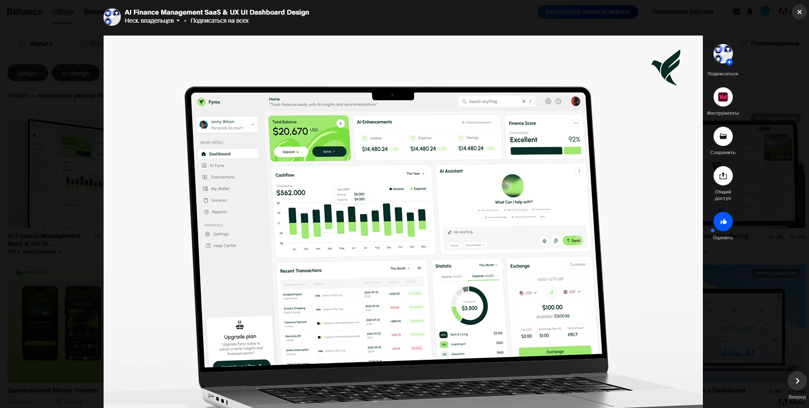
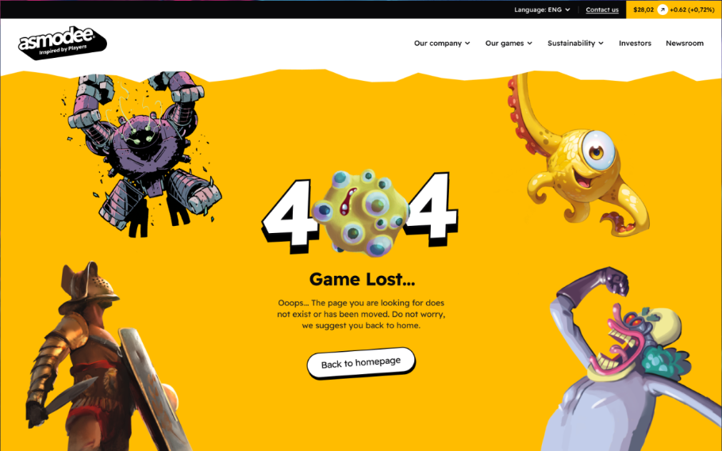

# Лабораторна робота №2
## Дисципліна: Основи UX/UI дизайну
## Тема: “Життєвий цикл розробки програмного продукту (SDLC). Аналіз ролей у команді та декомпозиція процесу створення інтерфейсу”
### Виконав: студент групи РПЗ-33, Руденко Дмитро
---
### Мета роботи:   
1. Закріпити знання про етапи життєвого циклу розробки ПЗ (SDLC) та місце дизайну в ньому.  
2. Навчитися ідентифікувати вузькоспеціалізовані ролі в IT-командах та їхні зони відповідальності.  
3. Розвинути навички реверс-інжинірингу (зворотного проєктування) — вміння розкладати готовий продукт на етапи його створення.  
4. Формувати професійну "надивленість" — здатність аналізувати чужі інтерфейсні рішення не на рівні "подобається/не подобається", а з точки зору функціональності та UX.

### Матеріальне забезпечення занять:  
1. Персональний комп'ютер, доступ до мережі Інтернет, смартфон (для аналізу додатків), браузер.  

### Завдання для попередньої підготовки.

**1. Розглянути матеріали лекції №2:**

 
<blockquote>
  
1.1. [Introduction To Software Development LifeCycle](https://www.youtube.com/watch?v=Fi3_BjVzpqk) 
1.2. [Введення у Web дизайн](https://www.youtube.com/watch?v=VdU81Kz9l6s)

</blockquote>

**2. Зробіть короткий словник (5-7 термінів) базових понять англ. мовою.**

_Словник базових понять англ. мовою_

| № | Слово | Пояснення |
| :--- | :--- | :--- |
| 1 | **SDLC (Software Development Life Cycle)** | Життєвий цикл розробки програмного забезпечення; процес, що включає чіткі етапи для ініціювання виробництва програмного забезпечення на основі вимог клієнта |
| 2 | **Requirement Analysis Phase** | Етап аналізу вимог; друга стадія, де обговорюється детальна інформація про кожен елемент, налаштовуються протоколи безпеки та проводиться аналіз ризиків |
| 3 | **SRS (Software Requirements Specification)** | Специфікація вимог до програмного забезпечення; документ, у якому фіксуються всі обговорені деталі, вимоги та технічні нюанси після етапу аналізу |
| 4 | **Design Phase** | Етап проєктування (дизайну); стадія, на якій розробники створюють системний дизайн та визначають загальну архітектуру програмного забезпечення (результат записується в DDS) |
| 5 | **Implementation Phase (Coding)** | Етап реалізації (кодування); етап, коли розробники починають писати код, використовуючи обрані мови програмування, компілятори та відлагоджувачі |
| 6 | **Testing Phase** | Етап тестування; перевірка функціонування всіх атрибутів ПЗ у різних тестових середовищах для пошуку помилок або багів |
| 7 | **Deployment and Maintenance** | Розгортання та підтримка; фінальний етап, коли програма стає доступною для користувачів, включає виправлення помилок та випуск оновлень для покращення продуктивності |

**3. Дайте відповіді на наступні питання:**

<blockquote>

**3.1. Розшифруйте абревіатуру SDLC.**

**SDLC** — Software Development Life Cycle (Життєвий цикл розробки програмного забезпечення).

**3.2. Що таке "вайрфрейм" (wireframe) і на якому етапі він створюється?**

Це схематичний "каркас" або чорновий начерк сторінки, який показує структуру та розташування елементів без деталізації дизайну (кольорів, картинок). Він створюється на етапі проєктування (UX-дизайну), після аналізу вимог, але перед візуалізацією (UI).

**3.3. Назвіть дві основні Hard Skills та дві Soft Skills, необхідні сучасному дизайнеру.**

**- Hard Skills:**

- Володіння інструментами (Figma, Adobe XD).
- Знання принципів композиції, типографіки та теорії кольору.

**- Soft Skills:**

- Комунікація (вміння пояснити свої рішення розробникам та бізнесу).
- Емпатія (здатність розуміти потреби та болі користувача).

**3.4.** ***Чому етап UX-дизайну (проєктування логіки) має передувати етапу UI-дизайну (візуалізації)? Що станеться, якщо зробити навпаки?**

Спочатку треба вирішити, як це працює, а потім — як це виглядає (принцип "Form follows function"). Якщо почати з UI, ми ризикуємо намалювати красиві кнопки, які ведуть у "глухий кут" або є незручними. Це призведе до необхідності переробляти готовий дизайн, що збільшує витрати часу та бюджету.

**3.5.** ***Опишіть процес передачі макету від дизайнера до розробника (Handoff). Що саме дизайнер має надати Frontend-розробнику окрім картинки макета?**

Дизайнер надає доступ до макету в режимі розробника (наприклад, Figma Dev Mode), де є:

- Параметри відступів (margin, padding) та розмірів.
- Коди кольорів (HEX/RGB) та параметри шрифтів.
- Експортовані графічні асети (іконки в SVG, картинки в PNG/WebP).
- Опис станів елементів (як кнопка виглядає при наведенні курсора — hover, active, disabled).

**3.6.** ***У чому полягає різниця між ролями UX Researcher та UI Designer?**

**UX Researcher** працює з людьми та даними, він проводить інтерв'ю, аналізує конкурентів, будує шлях користувача (User Journey). Його мета — зрозуміти проблему. Натомість **UI Designer** працює з графікою та екранами, тобто підбирає шрифти, малює іконки, створює фінальний візуальний стиль. Його мета — візуально вирішити проблему.

**3.7.** ****Як якісний UX-дизайн (наприклад, добре продумана валідація форм на клієнті) може знизити навантаження на Backend-сервер?**

Якщо інтерфейс перевіряє дані до відправки (наприклад, чи введено "@" в email, чи достатньо складний пароль), то браузер не надсилає "сміттєві" запити на сервер. Це зменшує кількість звернень до бази даних, економить трафік і ресурси сервера, оскільки він обробляє тільки коректні запити.

**3.8.** ****Уявіть, що на етапі тестування (QA) виявлено, що верстка суттєво відрізняється від макета дизайнера. Які можуть бути причини цього і як запобігти цьому в майбутньому (з точки зору процесів)?**

До причин можна віднести те, що розробник не мав доступу до всіх станів елементів, а дизайнер використовував нестандартні розміри (не по сітці), або була відсутня комунікація (розробник "додумав" сам). Запобігти цьому можна, впровадивши етап Design Review (авторський нагляд, коли дизайнер перевіряє верстку до передачі в QA) та використавши Design System (бібліотеку готових компонентів), щоб кнопки та поля всюди були однаковими.

</blockquote>

## Хід роботи

### Практичне завдання №1. Інтеграція вузьких спеціалістів у SDLC (базовий рівень)

| Роль | Етап(и) SDLC | Пояснення |
| :--- | :--- | :--- |
| **UX Writer** | *Етап 3 (UX)* *Етап 4 (UI)* | *Тексти мають бути продумані ще на етапі створення вайрфреймів (щоб закласти під них місце), а фіналізуються та вичитуються вже у чистовому макеті перед передачею в розробку* |
| **Motion Designer** | *Етап 4 (UI)* *Етап 5 (Розробка)* | *Створює прототипи анімацій на етапі візуалізації, щоб показати "живу" поведінку інтерфейсу. Під час розробки передає параметри анімації (таймінги, криві) програмістам* |
| **Accessibility Specialist** | *Етап 4 (UI)* *Етап 6 (Тестування)* | *На етапі дизайну перевіряє контрастність кольорів та розмір шрифтів. На етапі тестування перевіряє готовий код (наприклад, роботу скрінрідерами) на відповідність стандартам WCAG* |
| **DevOps Engineer** | *Етап 5 (Розробка)* *Етап 7 (Розгортання)* | *Налаштовує сервери та середовища (Development, Staging) під час написання коду. Є ключовою фігурою на етапі релізу, автоматизуючи доставку коду користувачам (CI/CD)* |
| **Business Analyst** | *Етап 1 (Планування)* *Етап 2 (Аналіз вимог)* | *Ця роль критична на старті. Він спілкується з замовником, збирає "хотілки" бізнесу і перетворює їх на технічну документацію (SRS), яку зрозуміють розробники та дизайнери* |
| **Security Specialist** | *Етап 2 (Аналіз вимог)* *Етап 6 (Тестування)* | *На початку допомагає закласти архітектуру безпеки. На етапі тестування проводить Pen-tests (тести на проникнення), намагаючись "зламати" систему до її виходу в світ* |

### Практичне завдання №2.*"Реверс-інжиніринг" процесу створення продукту (середній рівень)

**Об'єкт аналізу:** стандартний мобільний додаток "Будильник" (Clock App).

**- Етап 1 (Аналітика та Вимоги):** Зрозуміти контекст використання. (Відповідь: люди користуються додатком перед сном (стомлені) та зранку (роздратовані, сонні)). ТЗ: Інтерфейс має бути темним, щоб не сліпити вночі. Цифри мають бути величезними, щоб бачити без окулярів. Головна функція — надійність спрацювання.

**- Етап 2 (Референси та Дослідження):** Проаналізувати конкурентів та фізичні аналоги. Подивитися на класичні настільні годинники (великі кнопки зверху). Проаналізувати додатки Google Clock та Apple Clock. (Висновок: більшість використовує "барабан" (свайп) для вибору часу або цифрову клавіатуру. Потрібен перемикач (Toggle) для швидкого вмикання/вимикання збережених будильників).

**- Етап 3 (UX-дизайн / Проєктування логіки):** Розробити вайрфрейми та сценарії. Розділення кнопок "Вимкнути" (Stop) та "Відкласти" (Snooze) є ключовим рішенням. Кнопка "Відкласти" робиться величезною і по центру (бо людина зранку хоче спати і їй важко цілитися). Кнопка "Вимкнути" робиться меншою або вимагає складнішого руху (свайпу), щоб користувач точно прокинувся і не вимкнув будильник випадково уві сні.

**- Етап 4 (UI-дизайн / Візуалізація):** Створити фінальний вигляд (High-fidelity макет). Використання чорного фону (OLED-friendly) та контрастних акцентних кольорів (помаранчевий або яскраво-зелений) для активних елементів. Вибір моноширинного шрифту для цифр, щоб час "11:11" займав стільки ж місця, як "00:00", і дизайн не "стрибав".
Малювання станів перемикача (On — яскравий, Off — сірий/тьмяний).

**- Етап 5 (Прототипування та Анімація):** Показати розробникам, як інтерфейс рухається. Пропрацювати анімацію, зрозуміти як саме крутиться "барабан" вибору часу (з ефектом інерції). Як екран пульсує, коли лунає сигнал (візуальна тривога).

**- Етап 6 (Handoff / Передача в розробку):** Підготовка активів. (Результат: експорт іконок (плюсик, кошик, шестерня налаштувань) у форматі SVG. Створення Style Guide (коди кольорів, розміри шрифтів) для розробників).

**- Етап 7 (Frontend розробка / Верстка):** Програмісти створюють візуальну частину додатку за макетами дизайнера. Реалізують список будильників (List View), верстають екрани налаштувань, підключають анімації перемикачів.

**- Етап 8 (Backend розробка / Логіка):** У випадку будильника це "Local Backend". Розробка механізму таймера, який працює у фоновому режимі (навіть якщо телефон заблоковано). Робота з базою даних телефону (CoreData/SQLite) для збереження налаштувань часу, щоб вони не зникали після перезавантаження телефону.

**- Етап 9 (Тестування / QA):** Тестувальники перевіряють критичні сценарії:

- Чи спрацює будильник, якщо телефон у режимі "Не турбувати"?
- Чи спрацює він, якщо батарея < 5%?
- Що буде, якщо під час налаштування часу хтось подзвонить?

**-  Етап 10 (Реліз та Підтримка):** Публікація в App Store / Google Play. Збір відгуків. (Приклад підтримки: користувачі скаржаться, що кнопка "Вимкнути" занадто мала — у наступному оновленні дизайнер збільшує зону натискання).

### Практичне завдання №3. **Розвиток професійної надивленості (підвищений рівень) 

**1. Перейдіть на сайти професійних портфоліо та коротко опишіть їх. Як вони можуть знадобитись UX/UI-дизайнеру?**

| Платформа | Опис та користь для UX/UI дизайнера |
| :--- | :--- |
| **Dribbble** | Спільнота для публікації невеликих фрагментів (шотів). Ідеально для візуального натхнення (UI), трендових кольорів, іконок. Акцент на естетиці ("картинці"), а не на логіці. |
| **Behance** | Платформа для повноцінних кейсів (Case Studies). Дозволяє бачити весь процес роботи: дослідження, вайрфрейми, фінальний макет. Допомагає зрозуміти логіку (UX) та структуру проєктів. |
| **Awwwards** | Сайт, що нагороджує найкращі вебсайти світу за дизайн та код. Джерело натхнення для нестандартних рішень, складної верстки, анімацій та інтерактиву. Показує технічні можливості сучасного вебу. |

**2-3. Знайдіть на цих сайтах по 1 прикладу роботи на кожну з наведених нижче категорій (всього 3 роботи) і проаналізуйте їх. Для кожної роботи напишіть аналіз (2-3 речення)**

_- Складна вебформа або Дашборд. (Наприклад, CRM-система, панель адміністратора, форма замовлення квитка)._

**Робота на Bihance:** Banking Dashboard / Finance management.   
**Посилання:** [Приклад Banking Dashboard на Behance](https://www.behance.net/gallery/234937291/AI-Finance-Management-SaaS-UX-UI-DashboardDesign)

<blockquote>
  
- **Яку складну задачу вирішив дизайнер?**

Дизайнер зміг розмістити великий масив різнорідних фінансових даних (загальний баланс, графіки грошових потоків, список транзакцій, віджет обміну валют та навіть AI-асистента) на одному екрані так, щоб це не виглядало як заплутана таблиця Excel. 

- **Чому це рішення хороше з точки зору UX (зручності) або реалізації?**

Використано чітку карткову систему (Card UI) та модульну сітку, що дозволяє оку легко сканувати інформацію блоками. Дизайнери вибудували правильну візуальну ієрархію: найважливіше (Баланс) виділено яскравим зеленим кольором і розміром, тоді як другорядна інформація (списки, дрібні графіки) має стриманіший вигляд, що знижує когнітивне навантаження.

</blockquote>

 

_- Інтерфейс мобільного додатку з цікавою навігацією._

**Робота на Dribbble:** Liquid Tab Bar (Рідка навігація).
**Посилання:** [Приклад Liquid Tab Bar на Dribbble](https://dribbble.com/shots/13477554--Liquid-tab-bar-component-Source-code?utm_source=Clipboard_Shot&utm_campaign=cuberto&utm_content='Liquid'%20tab%20bar%20component%20%5BSource%20code%5D&utm_medium=Social_Share&utm_source=Clipboard_Shot&utm_campaign=cuberto&utm_content='Liquid'%20tab%20bar%20component%20%5BSource%20code%5D&utm_medium=Social_Share)

<blockquote>
  
- **Яку складну задачу вирішив дизайнер?**

Дизайнер перетворив рутинну, нудну дію (перемикання між розділами меню) на цікавий інтерактивний досвід. Замість звичайної зміни кольору іконки, він реалізував плавну анімацію, де активна зона "перетікає" від одного пункту до іншого, наче рідина.

- **Чому це рішення хороше з точки зору UX (зручності) або реалізації?**

Це яскравий приклад емоційного дизайну. Анімація дає користувачеві миттєвий і чіткий зворотний зв'язок (Feedback) про те, де він знаходиться. Рух привертає увагу і робить інтерфейс "живим" та чутливим до дотиків, що підвищує відчуття якості продукту.

</blockquote>

 

_- Якісна реалізація сторінки помилки 404._

**Робота на Awwwards:** Креативна 404 сторінка.
**Посилання:** [Приклад креативної 404 сторінка на Awwwards](https://www.awwwards.com/inspiration/asmodee-corporate-404-page-asmodee-corporate-1)

<blockquote>
  
- **Яку складну задачу вирішив дизайнер?**

Дизайнер перетворив технічну помилку на частину ігрового всесвіту бренду. Замість сухого "Page Not Found", користувачеві повідомляють "Game Lost..." (Гру програно), що є дотепною метафорою для сайту ігрової компанії. Це знижує роздратування від того, що сторінка не знайдена.

- **Чому це рішення хороше з точки зору UX (зручності) або реалізації?**

Використання фірмових персонажів та гумору утримує емоційний зв'язок з користувачем, зберігаючи контекст. Забезпечено можливість чіткого виходу: попри яскраву графіку, найважливіший елемент — кнопка "Back to homepage" — залишається контрастною, зрозумілою і знаходиться в центрі уваги, дозволяючи користувачеві швидко повернутися на правильний шлях.

</blockquote>

### Контрольні запитання

