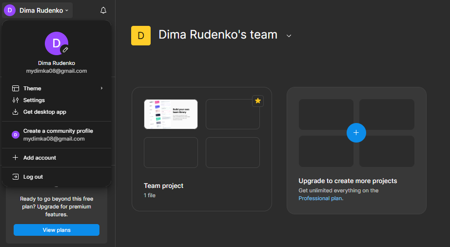
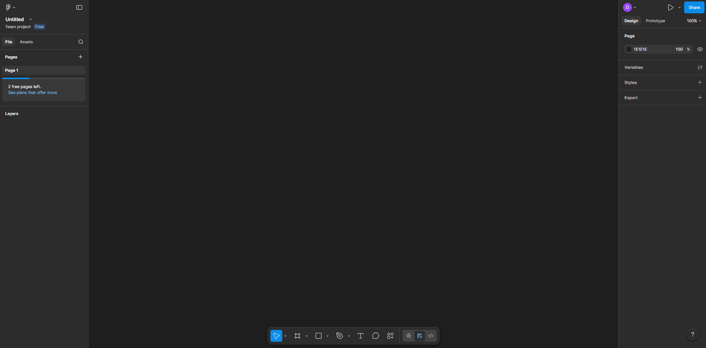
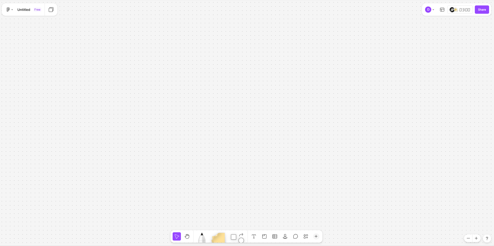

# Лабораторна робота №3
## Дисципліна: Основи UX/UI дизайну
## Тема: “Знайомство з Figma та FigJam та визначення теми комплексного проєкту”
### Виконав: студент групи РПЗ-33, Руденко Дмитро
---
### Мета роботи:   
1. Ознайомитися з можливостями Figma та FigJam (реєстрація під студентським акаунтом).  
2. Навчитися розрізняти інструменти для візуального дизайну та інструменти для досліджень. 

### Матеріальне забезпечення занять:  
1. Персональний комп'ютер, доступ до мережі Інтернет.  
2. Обліковий запис Google.  
3. Середовища Figma та FigJam.  

### Завдання для попередньої підготовки.

**1. Розглянути матеріали лекції №3.**

**2. Зробіть короткий словник (5-7 термінів) базових понять англ. мовою.**

_Словник базових понять англ. мовою_

| № | Слово | Пояснення |
| :--- | :--- | :--- |
| 1 | **UX Design (User Experience Design)** | Системний процес проєктування взаємодії користувача з продуктом. Це робота фахівця, який створює продукт (цифровий чи фізичний) з урахуванням досвіду користувача, намагаючись зрозуміти його потреби, поведінку, середовище та мотивацію, щоб створити зручне та ефективне рішення |
| 2 | **Design Thinking** | Підхід до розв'язання проблем, орієнтований на людину. Процес ґрунтується на послідовних ітеративних кроках: Empathize (розуміння користувача), Define (формулювання проблеми), Ideate (генерація ідей), Prototype (створення прототипу) та Test (перевірка рішення) |
| 3 | **User Personas** | Умовні портрети типових користувачів із їхніми характеристиками, потребами та проблемами. Вони допомагають команді зрозуміти, для кого створюється продукт, та адаптувати дизайн під конкретні сценарії використання |
| 4 | **Problem Statement** | Чіткий і стислий опис ключової проблеми користувача, сформований на основі досліджень. Воно визначає, що саме потрібно вирішити і чому, слугуючи опорою для подальших дизайн-рішень та базою для постановки задач розробникам |
| 5 | **User Stories** | Короткі описи потреб користувачів у зручному форматі, що пояснюють, яку цінність має надати продукт. Це UX-версія вимог до ПЗ, яка фокусує команду на цінності для користувача, а не лише на технічній реалізації |
| 6 | **Customer Journey Map (CJM)** | Схема, що показує, як користувач взаємодіє з продуктом крок за кроком, включно з його діями, емоціями та проблемами. Вона відображає ключові точки контакту (touchpoints) і допомагає виявити «болючі» точки досвіду користувача | 
| 7 | **Double Diamond** | Концепція «Подвійного діаманта», що використовує дивергентне (розширення) та конвергентне (звуження) мислення для розв'язання проблем. Складається з чотирьох етапів: Discover (дослідити), Define (сфокусувати), Develop (придумати) та Deliver (реалізувати) |

**3. Дайте відповіді на наступні питання:**

<blockquote>

**3.1. Яка головна різниця між Figma та FigJam (для яких завдань кожен інструмент кращий)?**

**- Figma** — це спеціалізована цифрова платформа для створення точних макетів, прототипів та роботи над фінальним візуальним стилем продукту. Вона найкраще підходить для етапів Prototype та Deliver, де потрібна висока деталізація.  
**- FigJam** — це онлайн-дошка для швидкого брейнстормінгу, скетчингу та візуалізації ідей на початкових етапах. Вона ідеальна для етапів Ideate та Define, де важливо швидко зафіксувати концепції, а не малювати ідеальні кнопки.

**3.2. Що таке "Двері Нормана" і як це поняття пов'язане з емпатією до користувача?**

**"Двері Нормана"** — це об'єкти, дизайн яких не дає правильної підказки щодо того, як ними користуватися (наприклад, двері, які треба тягнути, хоча вони мають вигляд таких, що треба штовхати). Це поняття напряму пов'язане з емпатією, оскільки дизайнер повинен мати здатність побачити світ очима іншої людини та відчути її «біль» від незручної взаємодії. Без емпатії дизайнер створює продукт «для себе», ігноруючи реальні труднощі користувача.

**3.3.** ***Поясніть різницю між Domain Research та User Interview.**

| Тип дослідження | Що вивчає | Мета |
| :--- | :--- | :--- |
| Domain Research | Специфіку галузі, терміни, обмеження та логіку роботи системи | Дозволяє дизайнеру говорити з експертами однією мовою та розуміти контекст бізнесу |
| User Interview | Реальний досвід, потреби та проблеми конкретних користувачів через відкриті питання | Допомагає отримати інсайти та зрозуміти, які саме задачі має вирішувати продукт насправді |

**3.4.** ***Чому на етапі дослідження важливо ставити питання "Чому?", а не просто фіксувати відповіді "Так/Ні"?**

- Відповіді «Так/Ні» фіксують лише поверхневу думку, тоді як UX-дизайнер повинен досліджувати саме поведінку.
- Використання техніки «5 Чому» дозволяє пройти крізь симптоми та знайти першопричину (root cause) проблеми.
- Якщо просто зафіксувати відповідь без розуміння мотиву, є ризик почати перемальовувати кнопку, замість того, щоб виправити помилкову логіку сценарію.

**3.5.** ****Чому UX-процес не починається з дизайну кнопок?**

Тому що UX-дизайнер шукає не «правильну кнопку», а справжню причину проблеми. У програмній інженерії та дизайні це схоже на аналіз вузьких місць: спочатку треба вибудувати алгоритм (user flow), а вже потім займатися його візуалізацією. Починати з кнопок — це часта помилка початківців, яка призводить до створення гарних, але абсолютно непотрібних або незручних інтерфейсів.

**3.6.** ****Що станеться з проєктом, якщо пропустити етап Empathy?**

Проєкт перетвориться на спробу «лікувати температуру» замість того, щоб знайти причину хвороби. Дизайнер не зможе сформулювати справжній Problem Statement, а отже, команда розроблятиме рішення на основі припущень, а не реальних потреб. У результаті вийде продукт, який не розуміє свого користувача і не розв'язує того, що справді треба.

</blockquote>

## Хід роботи

### Практичне завдання №1. Знайомство з Figma та FigJam (базовий рівень)

**1. Створіть акаунт у Figma (бажано через Google-пошту). Подайте заявку на Student Education Plan (це дасть безкоштовний доступ до професійних функцій).**

 

 

**2. Створити по одному файлу у Figma та у FigJam**
 
| Figma |
| :--- | 
|  |

| FigJam |
| :--- | 
 |

**3. Порівняти можливості інструментів:**

| Критерій | Figma | FigJam|
| :--- | :--- | :--- |
| Основне призначення | Професійне проєктування інтерфейсів, створення точних макетів та інтерактивних систем | Колективний «штурм» проблем, швидке візуальне фіксування ідей та проведення досліджень |
| Компоненти | Робота зі складними бібліотеками (UI Kits), сітками та точними параметрами елементів | Прості віджети, базові форми та стрілки для побудови логічних схем |
| Прототипування | Створення клікабельних інтерактивних прототипів, що імітують роботу справжнього додатка | Швидкий скетчинг та малювання концепцій без глибокої технічної деталізації |
| Sticky notes | Відсутні як нативний інструмент (використовуються плагіни або звичайні фігури) | Основний елемент для брейнстормінгу та структурування думок команди |
| Дослідження | Фіналізація результатів досліджень у вигляді High-Fidelity макетів для тестування | Проведення етапів емпатії, побудова Customer Journey Map (CJM) та мапування шляху користувача |

**Висновок:**

Відповідно до методології Design Thinking, на етапі дослідження (Research) — я буду працювати у FigJam. Це середовище найкраще підходить для «роботи детектива»: збору відгуків, проведення брейнстормінгів, пошуку root cause проблем через метод «5 Чому» та побудови емпатійних карт. Тут ми створюємо хаос ідей, який потім структуруємо. На етапі UI — я перейду у Figma. Коли справжню проблему вже визначено (Define), а рішення придумано (Develop) , Figma дозволяє втілити ці ідеї у вигляді точних вайрфреймів та фінального візуального стилю для передачі розробникам.

### Практичне завдання №2. *Формування ідеї семестрового проєкту (середній рівень)

**1. Студенти можуть працювати у командах 2–3 особи. Тоді у Figma та FigJam їх треба додати до спільного проєкту.**

**2. Обрати напрям (або запропонувати власний):**

- Мобільний додаток для відстеження фізичної активності з персональними тренуваннями, дієтичними рекомендаціями та соціальними викликами.

**3. У FigJam створити MindMap ідеї:**

- Цільова аудиторія
- Проблеми
- Можливі функції
- Конкуренти

### Практичне завдання №3. **Етап Empathy (підвищений рівень) 

**1. Всі завдання виконувати у FigJam.**

**2. Domain Research - дослідити 2–3 аналоги та визначити:**

- їхні сильні сторони
- слабкі сторони
- чого бракує

**_Оформити у вигляді таблиці на дошці FigJam._**

**3. User Interview - провести мінімум 2 інтерв’ю (одногрупники / знайомі).**

❌ Заборонено:
- “Вам подобається така ідея?”
- “Було б зручно?”
  
✅ Правильні питання:  
- “Коли ви востаннє стикались з цією проблемою?”
- “Що було найскладніше?”
- “Як ви зараз вирішуєте цю задачу?”
  
**_Зафіксувати відповіді у FigJam (sticky notes)._**

[Посилання на дошку FigJam]()

### Контрольні запитання

**1. Що таке Empathy в UX?**

**2.** ***Чому UX-дизайнер досліджує поведінку, а не думки?**

**3.** ****Чим відрізняється інтерв'ю (User Interview) від простого спостереження (Field Studies)?**

## Conclusions

