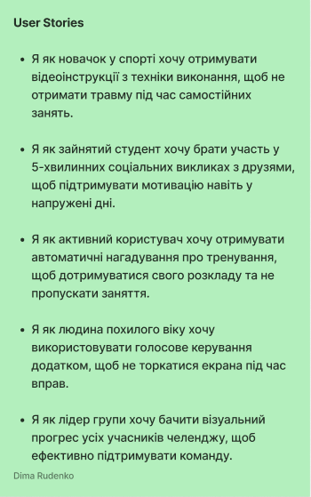

# Лабораторна робота №4
## Дисципліна: Основи UX/UI дизайну
## Тема: UX-дослідження та формування користувацьких вимог (етапи Empathy & Define) 
### Виконав: студент групи РПЗ-33, Руденко Дмитро

### Мета роботи: 
1. Опанувати методику UX-дослідження через аналіз конкурентів та інтерв'ю з користувачами.  
2. Навчитися структурувати отримані дані за допомогою інструментів емпатії.  
3. Сформувати портрет цільової аудиторії та проаналізувати її взаємодію з продуктом через Customer Journey Map (CJM).  
4. Розвинути навички візуальної комунікації ідей на онлайн-дошці FigJam.

### Матеріальне забезпечення занять:
1. Персональний комп'ютер, доступ до мережі Інтернет.
2. Обліковий запис Google.
3. Середовища Figma та FigJam.

### Завдання для попередньої підготовки.

**1. Розглянути матеріали лекції №3.**

  
**2. Зробіть короткий словник (5-7 термінів) базових понять англ. мовою. Наприклад, Persona, User Story, Touchpoint, Pain Point, Empathy, Journey Map, Prototype тощо.**

_Словник базових понять англ. мовою_

| № | Слово | Пояснення |
| :--- | :--- | :--- |
| 1	| Empathy | Здатність побачити світ очима користувача, щоб зрозуміти його потреби та справжній "біль" |
| 2 |	User Persona | Умовний портрет типового користувача з конкретними мотиваціями та характеристиками |
| 3	| User Story | Короткий опис вимог до системи з точки зору користі для кінцевого користувача |
| 4	| Touchpoint | Точка дотику або момент взаємодії користувача з продуктом на його шляху |
| 5	| Pain Point | "Точка болю" | Конкретна проблема або бар'єр, через який користувач відчуває дискомфорт чи залишає додаток |
| 6	| Journey Map (CJM) | Візуальна схема взаємодії користувача з продуктом крок за кроком, що включає дії та емоції |
| 7	| Prototype | Макети екранів або інтерактивна модель майбутнього продукту для тестування ідей |

**3. Дайте відповіді на наступні питання:**

<blockquote>
  
**3.1. Що таке Empathy в UX і чому це не те саме, що жалість до користувача?**

Емпатія — це глибоке дослідження реального стану речей через спостереження та інтерв'ю. На відміну від жалості, яка є лише пасивним співчуттям, емпатія в UX — це активний інструмент для пошуку "кореневої причини" проблеми. Вона дозволяє дизайнеру не просто жаліти людину, а відчути її труднощі, щоб створити функціональне рішення, яке ці труднощі усуне.

**3.2.** ***Навіщо потрібна Persona, якщо ми можемо просто описати «всіх людей 18–45 років»?**

Опис широкої аудиторії (18-45 років) є занадто абстрактним і не дає розуміння конкретних мотивів. User Persona перетворює сухі демографічні дані на "живого" персонажа з чіткими цілями та страхами. Це дозволяє команді адаптувати дизайн під реальні сценарії використання (наприклад, потреби студента кардинально відрізняються від потреб молодої мами чи офісного працівника в межах тієї ж вікової групи).

**3.3.** ****Що таке Pain Point і як її знайти під час інтерв'ю?**

Pain Point — це точка, де користувач стикається з найбільшими труднощами або роздратуванням. Під час інтерв'ю її можна знайти, уникаючи навідних запитань та фокусуючись на відкритих питаннях про минулий досвід: "Що було найскладніше?", "Чому ви припинили це робити?". Справжній "біль" часто ховається за відповіддю на третє чи четверте питання "Чому?".

</blockquote>
  
**4. Підготувати в електронному вигляді початковий варіант звіту:**
   
- Титульний аркуш, тема та мета роботи  
- Відповіді до завдань для попередньої підготовки

## Хід роботи

### Практичне завдання №1. Етап Define. Створення User Stories (базовий рівень)

**1. Розглянути додаткові навчальні матеріали та приклади:**

- [Як писати User Stories, щоб було зрозуміло всім](https://iampm.club/ua/blog/yak-pisati-user-stories-shhob-bulo-zrozumilo-vsim/)(рекомендовано усім)
- [User story – що це, для чого і чи можна обійтися без них?](https://brainrain.com.ua/uk/user-story/)
- [User Story в ІТ-проектах: Як писати вимоги з точки зору користувача](https://flexi-project.com/uk/user-story-%D0%B2-%D1%96%D1%82-%D0%BF%D1%80%D0%BE%D0%B5%D0%BA%D1%82%D0%B0%D1%85-%D1%8F%D0%BA-%D0%BF%D0%B8%D1%81%D0%B0%D1%82%D0%B8-%D0%B2%D0%B8%D0%BC%D0%BE%D0%B3%D0%B8-%D0%B7-%D1%82%D0%BE%D1%87%D0%BA/)
- [How to write good User Stories in Agile](https://www.youtube.com/watch?v=7hoGqhb6qAs)
- [20 User story examples and best practices](https://www.justinmind.com/blog/examples-user-story-best-practices/)(рекомендовано усім)
  
**2. На базі сформованої ідеї та етапу Empathy (див. ЛР №3) у FigJam сформуйте 4-5 User Stories для вашого продукту.**

Формат:  
Я як [роль] хочу [дія], щоб [користь]

### Практичне завдання №2. *Етап Define. Створення User Persona (середній рівень)

**1. Розглянути додаткові навчальні матеріали та приклади:**
   
- [User Persona ≠ Олег 30 років | Типи UX персон | 15 урок](https://www.youtube.com/watch?v=PLfy1FAMDYI)(рекомендовано усім)
- [How to Create A User Persona in 2026](https://www.youtube.com/watch?v=HkKf3Mhszww)
- [How To Make Persona In FigJam (2026 Guide)](https://www.youtube.com/watch?v=O8nkIOqyAsA)(рекомендовано усім)
- [How to Create a User Persona in Figma](https://www.youtube.com/watch?v=3V4g-FB_Olg)

**2. У FigJam створити дві User Persona для вашого продукту. Коротко опишіть їх.**

### Практичне завдання №3. **Етап Define. Створення Customer Journey Map (підвищений рівень) 

**1. Розглянути**

- [CJM — що це таке і як його будувати?](https://www.youtube.com/watch?v=q09sau-hK_I)
- [Як правильно будувати CUSTOMER JOURNEY MAP](https://www.youtube.com/live/x3HFghf-PuU)
- [FigJam tutorial: User journey mapping](https://www.youtube.com/watch?v=L4E1yupkISI)
- [Customer journey mapping in Figjam](https://www.youtube.com/watch?v=Dss4wKk0Dog)
  
**2. У FigJam створити Customer Journey Map для вашого продукту. Коротко опишіть її.**

### Контрольні запитання

**1. Чому User Story обов'язково має закінчуватися частиною «щоб [користь]»?**
**2.** ***Чому UX-дизайнер має досліджувати саме поведінку (що людина робить), а не її думки (що вона каже, що зробила б)?**
**3.** ****Як Customer Journey Map допомагає команді приймати продуктові рішення?**

Практичне завдання №3: Customer Journey Map (CJM) 

CJM для додатка включає етапи: Пошук → Реєстрація → Перше тренування → Соціальний виклик → Аналіз результатів.

Точка болю: на етапі реєстрації користувач дратується через занадто довгу анкету.

Рішення: спростити вхід через Google-акаунт та додати можливість заповнити дані пізніше.

4. Відповіді на контрольні запитання 

Чому User Story обов'язково має закінчуватися частиною «щоб [користь]»? Ця частина є найважливішою, оскільки вона фокусує команду на цінності для користувача, а не просто на технічній реалізації функції. Без розуміння користі розробники можуть створити функцію, яка працює технічно, але не вирішує жодної реальної проблеми.

Чому UX-дизайнер має досліджувати саме поведінку, а не думки? Люди часто кажуть те, що від них хочуть почути, або самі не усвідомлюють своїх звичок. Дослідження поведінки (що людина робить) дає об'єктивні дані про те, де вона насправді зупиняється чи робить помилки, тоді як думки є суб'єктивними та часто помилковими.

Як Customer Journey Map допомагає команді приймати продуктові рішення? CJM дозволяє побачити "картину в цілому" і знайти конкретні етапи, де користувачі найчастіше покидають додаток. Це допомагає команді пріоритезувати задачі: наприклад, замість додавання нових фільтрів (що хочуть розробники), виправити складний процес оплати (де користувачі відчувають біль).

5. Conclusion (English) 

In this laboratory work, I focused on the first "diamond" of the Double Diamond model: the Empathy and Define stages. By mastering UX research methods like competitor analysis and user interviewing, I learned that a successful product starts with a deep understanding of the user's "pain" rather than visual sketches.

The creation of User Stories and Personas allowed me to transform raw research data into human-centered requirements, ensuring that every feature provides real value to the target audience. Furthermore, building a Customer Journey Map provided a clear visualization of where users might struggle, highlighting critical opportunities for improvement. Ultimately, I realized that analyzing actual behavior—what people do—is far more effective for making product decisions than relying on stated opinions. This work has laid a solid foundation for the subsequent stages of interaction design and prototyping.

Чи хочеш ти, щоб я допоміг тобі підготувати посилання на FigJam або оформити титульну сторінку згідно з вимогами вашого коледжу?

Ваше повідомлення
Надішли повністю це все, без скорочень, як є, одним текстом для md сторінки на гітхаб (в тому числі табличку, тобто прям все, що ти зараз написав в такому самому порядку)

Повідомлення Gemini
Ось повний текст твоєї лабораторної роботи у форматі Markdown. Ти можеш просто скопіювати цей код і вставити його у файл README.md або будь-який інший .md файл на GitHub.

Лабораторна робота №4

Дисципліна: Основи UX/UI дизайну Тема: UX-дослідження та формування користувацьких вимог (етапи Empathy & Define) 
Мета роботи: Опанувати методику UX-дослідження через аналіз конкурентів та інтерв'ю з користувачами; навчитися структурувати отримані дані за допомогою інструментів емпатії; сформувати портрет цільової аудиторії та проаналізувати її взаємодію з продуктом через Customer Journey Map (CJM). 

1. Короткий словник базових понять (Glossary)
№	English Term	Пояснення (Ukrainian)
1	Empathy	
Здатність побачити світ очима іншої людини, навіть якщо її досвід кардинально відрізняється від вашого. 

2	User Persona	
Умовний портрет типового користувача з його характеристиками, потребами та проблемами. 

3	User Story	
Короткий опис потреб користувача у форматі «Я як [роль] хочу [дія], щоб [користь]». 

4	Touchpoint	
Ключова точка контакту або момент взаємодії користувача з продуктом. 

5	Pain Point	
«Точка болю» — конкретна проблема, де користувач стикається з труднощами або залишає додаток. 

6	Journey Map (CJM)	
Схема, що показує шлях користувача крок за кроком, включаючи його дії, емоції та проблеми. 

7	Prototype	
Клікабельний макет або модель, що імітує роботу справжнього додатка для тестування. 

2. Завдання для попередньої підготовки
3.1. Що таке Empathy в UX і чому це не те саме, що жалість до користувача?
Емпатія в UX — це здатність відчути «біль» користувача та зрозуміти його мотивацію. На відміну від жалості, яка є пасивним почуттям, емпатія — це інструмент для пошуку справжньої причини проблеми (root cause). Вона дозволяє дизайнеру не просто співчувати, а діяти як «детектив», щоб знайти баланс між потребами людини та бізнесу. 

3.2. Навіщо потрібна Persona, якщо ми можемо просто описати «всіх людей 18-45 років»?
Абстрактний опис аудиторії не дає розуміння конкретних сценаріїв використання. User Persona створює живий портрет із конкретними мотиваціями. Це допомагає команді адаптувати дизайн під реальні потреби (наприклад, студент і викладач мають різні цілі в межах одного додатка). 

3.3. Що таке Pain Point і як її знайти під час інтерв'ю?

Pain Point — це «точка болю», де користувач відчуває найбільший дискомфорт.  Щоб знайти її під час інтерв'ю, важливо ставити відкриті питання про минулий досвід: «Що було найскладніше?» або «Чому ви припинили це робити?». Справжній біль часто виявляється через дослідження поведінки, а не просто думок. 

3. Хід роботи
Практичне завдання №1. Етап Define. Створення User Stories
На основі ідеї фітнес-додатка з соціальними викликами розроблено наступні історії користувачів: 

Я як новачок у спорті хочу отримувати відеоінструкції з підказками, щоб правильно виконувати вправи без допомоги тренера. 

Я як зайнятий студент хочу брати участь у групових викликах з друзями, щоб підтримувати мотивацію через змагання. 

Я як активний користувач хочу отримувати нагадування про тренування, щоб не пропускати заняття та дотримуватися розкладу. 

Я як літня людина хочу використовувати голосовий інтерфейс, щоб керувати програмою без ручного вводу під час вправ. 

Я як адміністратор групи хочу бачити візуальний прогрес учасників, щоб аналізувати ефективність програми. 

Практичне завдання №2. Етап Define. Створення User Persona
Сформовано два типи персонажів для кращого розуміння аудиторії: 

Денис (21 рік), студент ІТ-факультету. 

Мотивація: Вивчення нових технологій, підвищення рівня навичок для майбутньої роботи. 

Болі: Несистематизована інформація, відсутність практичного застосування теорії. 

Мар'яна (56 років), викладач. 

Мотивація: Зробити навчання цікавим, використовувати сучасні методи підтримки здоров'я. 

Болі: Надмірна технічна складність інтерфейсів, нездатність швидко адаптуватися до нового контенту. 

Практичне завдання №3. Етап Define. Створення Customer Journey Map (CJM)
Розроблена мапа шляху користувача включає етапи від вибору активності до аналізу результатів. 

Основна мета: Виявити проблеми, що виникають у користувачів, та знайти способи їх вирішення. 

Ключові етапи: Перегляд викликів (Очікування) → Виконання вправ (Задоволення/Втома) → Отримання бейджа (Радість). 

Pain Points: Відсутність фотографій вправ або занадто тривале очікування завантаження контенту. 

4. Контрольні запитання
Чому User Story обов'язково має закінчуватися частиною «щоб [користь]»?
Ця частина фокусує команду розробки на цінності для користувача, а не просто на технічній реалізації функції.  Без розуміння користі продукт може стати набором інструментів, які нікому не потрібні.

Чому UX-дизайнер має досліджувати саме поведінку (що людина робить), а не її думки?
Тому що люди часто говорять одне, а роблять інше. Спостереження за реальною поведінкою допомагає знайти справжню причину проблеми (root cause), яку користувач може навіть не усвідомлювати. 

Як Customer Journey Map допомагає команді приймати продуктові рішення?
CJM допомагає знайти «точки болю», де користувач найчастіше залишає додаток. Це дозволяє команді приймати обґрунтовані рішення щодо того, які функції потрібно покращити в першу чергу, щоб підвищити задоволеність клієнтів. 

5. Conclusion (English)
In this laboratory work, I explored the critical first half of the Double Diamond model, specifically focusing on the Empathy and Define stages. By mastering UX research techniques such as competitor analysis and user interviewing, I learned that professional design begins with evidence rather than assumptions.

The creation of User Stories and User Personas transformed raw research data into clear, actionable requirements centered on human needs. Furthermore, developing a Customer Journey Map allowed me to visualize the user experience as a holistic process, identifying specific "pain points" where interaction fails. Ultimately, this work demonstrated that the primary goal of a UX designer is to act as a bridge between business goals and user convenience, ensuring that every digital solution provides real value and solves actual problems.

