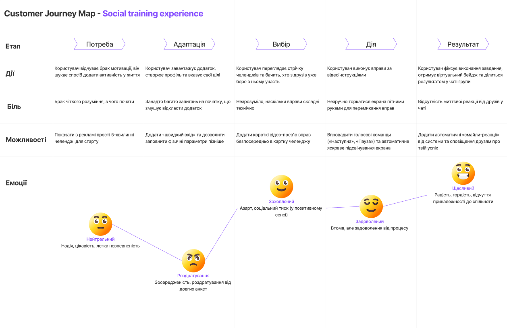

# Лабораторна робота №4
## Дисципліна: Основи UX/UI дизайну
## Тема: UX-дослідження та формування користувацьких вимог (етапи Empathy & Define) 
### Виконав: студент групи РПЗ-33, Руденко Дмитро

### Мета роботи: 
1. Опанувати методику UX-дослідження через аналіз конкурентів та інтерв'ю з користувачами.  
2. Навчитися структурувати отримані дані за допомогою інструментів емпатії.  
3. Сформувати портрет цільової аудиторії та проаналізувати її взаємодію з продуктом через Customer Journey Map (CJM).  
4. Розвинути навички візуальної комунікації ідей на онлайн-дошці FigJam.

### Матеріальне забезпечення занять:  
1. Персональний комп'ютер, доступ до мережі Інтернет.  
2. Обліковий запис Google.  
3. Середовища Figma та FigJam.

### Завдання для попередньої підготовки.

**1. Розглянути матеріали лекції №3.**

  
**2. Зробіть короткий словник (5-7 термінів) базових понять англ. мовою. Наприклад, Persona, User Story, Touchpoint, Pain Point, Empathy, Journey Map, Prototype тощо.**

_Словник базових понять англ. мовою_

| № | Слово | Пояснення |
| :--- | :--- | :--- |
| 1	| Empathy | Здатність побачити світ очима користувача, щоб зрозуміти його потреби та справжній "біль" |
| 2 |	User Persona | Умовний портрет типового користувача з конкретними мотиваціями та характеристиками |
| 3	| User Story | Короткий опис вимог до системи з точки зору користі для кінцевого користувача |
| 4	| Touchpoint | Точка дотику або момент взаємодії користувача з продуктом на його шляху |
| 5	| Pain Point | "Точка болю" - конкретна проблема або бар'єр, через який користувач відчуває дискомфорт чи залишає додаток |
| 6	| Journey Map (CJM) | Візуальна схема взаємодії користувача з продуктом крок за кроком, що включає дії та емоції |
| 7	| Prototype | Макети екранів або інтерактивна модель майбутнього продукту для тестування ідей |
| 8 | Domain Research | Дослідження предметної області - вивчення специфіки галузі, термінів, процесів та обмежень системи перед початком проєктування |
| 9 | User Flow | Візуальна схема послідовності кроків (алгоритм), які виконує користувач для досягнення конкретної цілі в додатку |
| 10 | Problem Statement | Чіткий і стислий опис ключової проблеми користувача, який визначає, що саме потрібно вирішити і чому |
| 11 | Double Diamond | Концепція «Подвійного діаманта», що розділяє дизайн-процес на чотири етапи: дослідження проблеми (Discover, Define) та створення рішень (Develop, Deliver) |
| 12 | Wireframes | Схематичні макети екранів, які показують розташування основних елементів інтерфейсу без детального візуального оформлення |
| 13 | Root Cause | Справжня (коренева) причина проблеми, яку UX-дизайнер шукає за допомогою методу «5 Чому», щоб не просто «лікувати симптоми» |
| 14 | Usability Testing | Дослідження, спрямоване на перевірку того, наскільки зручно користувачам виконувати конкретні завдання в інтерфейсі |

**3. Дайте відповіді на наступні питання:**

<blockquote>
  
**3.1. Що таке Empathy в UX і чому це не те саме, що жалість до користувача?**

**Емпатія** — це глибоке дослідження реального стану речей через спостереження та інтерв'ю. На відміну від жалості, яка є лише пасивним співчуттям, емпатія в UX — це активний інструмент для пошуку "кореневої причини" проблеми. Вона дозволяє дизайнеру не просто жаліти людину, а відчути її труднощі, щоб створити функціональне рішення, яке ці труднощі усуне.

**3.2.** ***Навіщо потрібна Persona, якщо ми можемо просто описати «всіх людей 18–45 років»?**

Опис широкої аудиторії (18-45 років) є занадто абстрактним і не дає розуміння конкретних мотивів. User Persona перетворює сухі демографічні дані на "живого" персонажа з чіткими цілями та страхами. Це дозволяє команді адаптувати дизайн під реальні сценарії використання (наприклад, потреби студента кардинально відрізняються від потреб молодої мами чи офісного працівника в межах тієї ж вікової групи).

**3.3.** ****Що таке Pain Point і як її знайти під час інтерв'ю?**

**Pain Point** — це точка, де користувач стикається з найбільшими труднощами або роздратуванням. Під час інтерв'ю її можна знайти, уникаючи навідних запитань та фокусуючись на відкритих питаннях про минулий досвід: "Що було найскладніше?", "Чому ви припинили це робити?". Справжній "біль" часто ховається за відповіддю на третє чи четверте питання "Чому?".

</blockquote>
  
**4. Підготувати в електронному вигляді початковий варіант звіту:**
   
- Титульний аркуш, тема та мета роботи  
- Відповіді до завдань для попередньої підготовки

## Хід роботи

### Практичне завдання №1. Етап Define. Створення User Stories (базовий рівень)

**1. Розглянути додаткові навчальні матеріали та приклади:**

- [Як писати User Stories, щоб було зрозуміло всім](https://iampm.club/ua/blog/yak-pisati-user-stories-shhob-bulo-zrozumilo-vsim/) (рекомендовано усім)
- [User story – що це, для чого і чи можна обійтися без них?](https://brainrain.com.ua/uk/user-story/)
- [User Story в ІТ-проектах: Як писати вимоги з точки зору користувача](https://flexi-project.com/uk/user-story-%D0%B2-%D1%96%D1%82-%D0%BF%D1%80%D0%BE%D0%B5%D0%BA%D1%82%D0%B0%D1%85-%D1%8F%D0%BA-%D0%BF%D0%B8%D1%81%D0%B0%D1%82%D0%B8-%D0%B2%D0%B8%D0%BC%D0%BE%D0%B3%D0%B8-%D0%B7-%D1%82%D0%BE%D1%87%D0%BA/)
- [How to write good User Stories in Agile](https://www.youtube.com/watch?v=7hoGqhb6qAs)
- [20 User story examples and best practices](https://www.justinmind.com/blog/examples-user-story-best-practices/) (рекомендовано усім)
  
**2. На базі сформованої ідеї та етапу Empathy (див. ЛР №3) у FigJam сформуйте 4-5 User Stories для вашого продукту.**

Формат:  
Я як [роль] хочу [дія], щоб [користь]

### Практичне завдання №2. *Етап Define. Створення User Persona (середній рівень)

**1. Розглянути додаткові навчальні матеріали та приклади:**
   
- [User Persona ≠ Олег 30 років | Типи UX персон | 15 урок](https://www.youtube.com/watch?v=PLfy1FAMDYI) (рекомендовано усім)
- [How to Create A User Persona in 2026](https://www.youtube.com/watch?v=HkKf3Mhszww)
- [How To Make Persona In FigJam (2026 Guide)](https://www.youtube.com/watch?v=O8nkIOqyAsA) (рекомендовано усім)
- [How to Create a User Persona in Figma](https://www.youtube.com/watch?v=3V4g-FB_Olg)

**2. У FigJam створити дві User Persona для вашого продукту. Коротко опишіть їх.**

### Практичне завдання №3. **Етап Define. Створення Customer Journey Map (підвищений рівень) 

**1. Розглянути**

- [CJM — що це таке і як його будувати?](https://www.youtube.com/watch?v=q09sau-hK_I)
- [Як правильно будувати CUSTOMER JOURNEY MAP](https://www.youtube.com/live/x3HFghf-PuU)
- [FigJam tutorial: User journey mapping](https://www.youtube.com/watch?v=L4E1yupkISI)
- [Customer journey mapping in Figjam](https://www.youtube.com/watch?v=Dss4wKk0Dog)
  
**2. У FigJam створити Customer Journey Map для вашого продукту. Коротко опишіть її.**

Створена карта — це візуальна схема, яка крок за кроком описує взаємодію користувача з продуктом у межах сценарію «Досвід соціальних тренувань». До ключових аспектів карти належить структура шляху, яка охоплює повний цикл взаємодії — від виникнення потреби в активності до отримання соціального визнання за результат. Головний акцент зроблено на «точках болю» (Pain Points), таких як перевантажений онбординг та складність керування смартфоном під час тренування. Карта слугує інструментом для прийняття продуктових рішень, пропонуючи впровадження голосових команд та спрощеного входу для покращення досвіду. Також карта відображає зміну внутрішнього стану користувача — від початкового хвилювання та роздратування на етапі реєстрації до піднесення й радості після завершення вправ.

[Посилання на дошку FigJam](https://www.figma.com/board/aQcOWxeTycWDsSxUdgyEIL/Untitled?node-id=0-1&p=f&t=cMjF8zOCyBOItc6b-0)

### Контрольні запитання

**1. Чому User Story обов'язково має закінчуватися частиною «щоб [користь]»?**

Ця частина є найважливішою, оскільки вона фокусує команду на цінності для користувача, а не просто на технічній реалізації функції. Без розуміння користі розробники можуть створити функцію, яка працює технічно, але не вирішує жодної реальної проблеми.

**2.** ***Чому UX-дизайнер має досліджувати саме поведінку (що людина робить), а не її думки (що вона каже, що зробила б)?**

Люди часто кажуть те, що від них хочуть почути, або самі не усвідомлюють своїх звичок. Дослідження поведінки (що людина робить) дає об'єктивні дані про те, де вона насправді зупиняється чи робить помилки, тоді як думки є суб'єктивними та часто помилковими.

**3.** ****Як Customer Journey Map допомагає команді приймати продуктові рішення?**

CJM дозволяє побачити "картину в цілому" і знайти конкретні етапи, де користувачі найчастіше покидають додаток. Це допомагає команді пріоритезувати задачі: наприклад, замість додавання нових фільтрів (що хочуть розробники), виправити складний процес оплати (де користувачі відчувають біль).

## Conclusions

&nbsp;&nbsp;&nbsp;In this laboratory work, I focused on the first "diamond" of the Double Diamond model: the Empathy and Define stages. By mastering UX research methods like competitor analysis and user interviewing, I learned that a successful product starts with a deep understanding of the user's "pain" rather than visual sketches.   
&nbsp;&nbsp;&nbsp;The creation of User Stories and Personas allowed me to transform raw research data into human-centered requirements, ensuring that every feature provides real value to the target audience. Furthermore, building a Customer Journey Map provided a clear visualization of where users might struggle, highlighting critical opportunities for improvement. Ultimately, I realized that analyzing actual behavior — what people do — is far more effective for making product decisions than relying on stated opinions. This work has laid a solid foundation for the subsequent stages of interaction design and prototyping.
