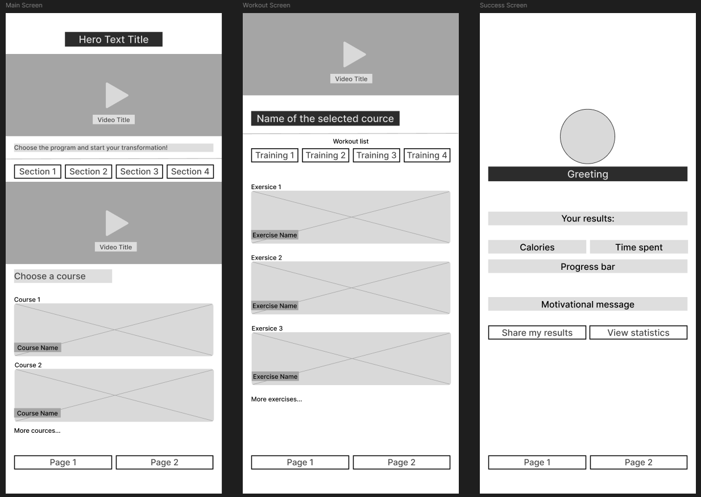

# Лабораторна робота №5
## Дисципліна: Основи UX/UI дизайну
## Тема: Проєктування архітектури та створення вайрфреймів у Figma. Від User Flow до Low-fidelity прототипу 
### Виконав: студент групи РПЗ-33, Руденко Дмитро

### Мета роботи: 
1. Навчитися перетворювати результати досліджень (User Stories та CJM) у конкретну логічну структуру (User Flow).    
2. Опанувати інструментарій Figma для створення низькодеталізованих макетів (Low-fidelity Wireframes).    
3. Закріпити навички роботи з сітками, типографікою та ієрархією компонентів без використання кольору.    
4. Створити «скелет» майбутнього проєкту, який базується на потребах реальних користувачів.   

### Матеріальне забезпечення занять:  
1. Персональний комп'ютер, доступ до мережі Інтернет.  
2. Обліковий запис Google.  
3. Середовища Figma та FigJam.

### Завдання для попередньої підготовки.

  
**1. Розглянути матеріали лекції №4. Зробіть короткий словник (5-7 термінів) базових понять англ. мовою.**

_Словник базових понять англ. мовою_

| № | Слово | Пояснення |
| :--- | :--- | :--- |
| 1	| Prototyping | Прототипування — етап перетворення ідей на візуальні рішення для перевірки логіки, сценаріїв та зручності до початку програмування |
| 2 |	Fidelity | Точність дизайну — міра деталізації прототипу, що визначає ступінь його наближеності до фінального вигляду продукту |
| 3	| User Flow | Потік користувача — візуальна схема, що описує загальний шлях користувача до досягнення певної цілі в продукті |
| 4	| Task Flow | Потік завдання — послідовність дій, яка концентрується на виконанні конкретної невеликої задачі, щоб уникнути перевантаження загальної схеми |
| 5	| Wireframe | Вайрфрейм — статичне чорно-біле зображення екрана, яке визначає розташування UI-елементів та інформаційну ієрархію |
| 6	| Wireflow | Вайрфлоу — сценарій взаємодії, що складається з послідовності вайрфреймів для демонстрації роботи складної логіки |
| 7	| Interactive Prototype | Інтерактивний прототип — макет інтерфейсу, що реагує на дії користувача (кліки, свайпи), імітуючи роботу реального додатка |

**2.Дайте відповіді на наступні питання:**  

<blockquote>

**2.1. Чим Task Flow відрізняється від User Flow?**

**User Flow** — це загальний шлях користувача до досягнення певної цілі в продукті. Він показує широку картину взаємодії з системою.  
**Task Flow** — це послідовність дій у межах одного конкретного завдання. Він концентрується на дрібніших задачах (наприклад, пошук за локацією або редагування кошика).  
Основна різниця між ними полягає в масштабі. Розбиття на Task Flow дозволяє працювати з маленькими фрагментами інформації, щоб загальна схема не набула «монструозних розмірів» і залишалася зрозумілою.

**2.2.** ***Чому вайрфрейми зазвичай виконуються у відтінках сірого?**

По перше, вайрфрейми фокусуються на структурі. Обмеження чорно-білою або сірою палітрою допомагає зосередитися на розташуванні елементів та формуванні інформаційної ієрархії, а не на візуальному оформленні. По друге, вони зменшують когнітивне навантаження через відсутність кольорів, що дозволяє команді та замовнику не відволікатися на естетику і приймати рішення щодо функціональності та логіки інтерфейсу. І нарешті, у такий спосіб вони економлять час, що дозволяє швидше вносити правки та експериментувати з концепціями на ранніх етапах.

**2.3.** ****Що таке «Grey Box Method» у прототипуванні?**

**Grey Box Method** — це техніка створення низькодеталізованих вайрфреймів (Low-fi), де всі елементи інтерфейсу та контент зображуються у вигляді простих сірих фігур.

</blockquote>

**3.Познайомтесь з поняттям Layout Grid:**  
- [https://www.geeksforgeeks.org/css/grids-in-figma/](https://www.geeksforgeeks.org/css/grids-in-figma/)  
- [Master Responsive Grids (Rows & Columns) in Figma](https://www.youtube.com/watch?v=sybtdc4dYzE)  
- [Figma for Edu: Layout grids](https://www.youtube.com/watch?v=HA2QoXu2K_Q)  
- [Layout Design - How To Use Grids In Figma](https://www.youtube.com/watch?v=DK4_DcCS_WA)  
- [Layout Grid | Grids in Figma](https://www.youtube.com/watch?v=QU3bAB3jfVA)  

** Підготувати в електронному вигляді початковий варіант звіту:**    
- Титульний аркуш, тема та мета роботи   
- Відповіді до завдань для попередньої підготовки

## Хід роботи

### Практичне завдання №1. Побудова логіки (User Flow / Task Flow) (базовий рівень)

**1. Розглянути додаткові навчальні матеріали та приклади:**   
- [Як створювати ефективні USER FLOW в UX-дизайні | 22 урок курсу UX](https://www.youtube.com/watch?v=SL2MLfsZQn0&t=85s)
- [How To Make User Flow In Figma (Easiest Way) (2026 Guide)](https://www.youtube.com/watch?v=sVEE6JLHBw8)
- [how to make user flow in figma](https://www.youtube.com/watch?v=nCohgD-If5Q)
- [How To Use FigJam To Create User Flow (2026 Guide)](https://www.youtube.com/watch?v=kYa1wiYI_oI)

**2. На основі ваших User Stories та CJM (див. ЛР №4) у FigJam або Figma розробіть схему руху користувача для основного сценарію (наприклад, реєстрація + виконання цільової дії):**  
- Позначте початок і кінець (овали).  
- Відобразіть екрани (прямокутники) та дії користувача (стрілки з підписами).  
- Обов’язково додайте хоча б одну точку прийняття рішення (ромб), наприклад: «Чи ввів користувач пароль вірно?» → ТАК/НІ.

[Посилання на дошку FigJam](https://www.figma.com/board/SxHHTWcIkWdaEROXZ1lcna/User-Flow-Template?node-id=0-1&p=f&t=fZyifx0yGlwrIo3K-0)

### Практичне завдання №2. *Створення Low-fidelity вайрфреймів (базовий рівень)

**1. Розглянути додаткові навчальні матеріали та приклади:**
- [СЕКРЕТИ ЕФЕКТИВНОГО ПРОТОТИПУВАННЯ В UX: який прототип обрати та як створити | 23 урок UX](https://www.youtube.com/watch?v=tCEOZYR9O6E)
- [How to Wireframe in Figma in 2026](https://www.youtube.com/watch?v=qWIdforZ9x0)(дуже круте відео)
- [Figma Wireframe in 7 Minutes for Beginners in 2025 (Figma Tutorial)](https://www.youtube.com/watch?v=UEsrr6FmZ-U)
- [Design a Low Fidelity Prototype in Figma](https://www.youtube.com/playlist?list=PLfA4SdpraCK0WsYcyCh8r39YpbZY3XpLC)(можна взяти відпрацювати цей дизайн покроково, хто не має якогось свого творчого бажання придумувати якийсь свій дизайн)

**2. Створіть 3–5 екранів вашого додатку/сервісу у форматі Low-fi Wireframes (використовуйте сірі прямокутники, лінії та плейсхолдери для фото — перекреслені бокси).**

**3. Обов’язкові екрани:**  
- Головний екран.  
- Екран виконання основної функції (згідно з вашою ідеєю).  
- Екран успішного завершення дії (Success State).
  
На основі розробленого User Flow було спроєктовано «скелет» фітнес-застосунку у форматі низькодеталізованих макетів. Основна мета цього етапу — перевірити логіку розташування елементів та інформаційну ієрархію до моменту залучення візуального дизайну.
Макет виконано за методом «Grey Box», де замість реального контенту використано абстрактні фігури. Нижче представлений Style Guide та 3 Low-fi макети для різних екранів застосунку (Головний екран, екран тренування, екран успішного проходження тренування):

**4. Дослідіть питання, які є рекомендації щодо створення  вайрфреймів з Layout Grid для різних пристроїв? Як ви їх врахували у своєму дизайні?**

При проєктуванні вайрфреймів для основного сценарію я дотримувався певних приципів. Так, оскільки цільовою платформою є мобільний пристрій, я застосував 4-колонкову сітку (Column grid). Це забезпечило чітку структуру для таких елементів, як картки тренувань та статистичні показники на головному екрані.

Система відступів: я впровадив 8-піксельну систему (8-point system), де всі відступи між блоками (gutter) та внутрішні поля (padding) кратні 8 px. Це дозволило уникнути хаотичності та забезпечило «повітря» в інтерфейсі.

Вирівнювання (Alignment): усі інтерактивні елементи, включаючи кнопки та поля введення даних (наприклад, у формі реєстрації), суворо вирівняні по межах колонок сітки.

Ієрархія та ширина блоків: важливі функціональні елементи, як-от кнопка «Почати тренування» або таймер, займають усю ширину контейнера (4 колонки), щоб привернути максимум уваги користувача, тоді як допоміжна інформація може займати менше простору.

Використання Layout Grid дозволило створити логічний та масштабований «скелет» продукту, який легко адаптувати під різні екрани та передати в подальшу розробку.

[Посилання на проєкт у Figma]()

### Практичне завдання №3. *Наповнення контентом та High-fi Wireframing (середній рівень) 

**1. Перетворіть свої Low-fi начерки на High-fidelity Wireframes:**  
- Замініть абстрактні лінії на реальний текст (ніякого Lorem Ipsum!).  
- Використовуйте стандартні іконки (можна взяти плагіни Iconify або Feather Icons).  
- Пропрацюйте ієрархію: заголовки мають бути жирнішими та більшими за основний текст.
  
**2. Вкажіть розміри основних елементів, які були використані у вашому дизайні.**

[Посилання на проєкт у Figma]()

### Практичне завдання №4. **Створення Wireflow та інтерактивність (підвищений рівень) 

**1. Поєднайте ваші вайрфрейми стрілками прямо у Figma, показуючи логіку переходів (аналогічно до завдання №1, але з реальними макетами).**

**2. Розглянути додаткові навчальні матеріали та приклади:**
- [Figma Prototyping in 20 minutes | How to prototype in Figma - a beginners guide | Figma 2025](https://www.youtube.com/watch?v=k1iwiHJrAWI)
- [Figma Tutorial 2026: Prototyping](https://www.youtube.com/watch?v=iW9RmDD1yDs)

**3. Створіть свій невеликий інтерактивний прототип:**  
- Перейдіть у вкладку Prototype у Figma.  
- Налаштуйте зв’язки між кнопками та екранами.  
- Налаштуйте стан «Loading» або перехід для точки прийняття рішення.  
- Запустіть режим презентації та перевірте, чи може стороння людина пройти шлях від початку до кінця.

### Контрольні запитання

**1. Який елемент вайрфрейму вказує на те, що тут буде зображення?**

**2. Навіщо використовувати реальні тексти замість "Lorem Ipsum" на етапі High-fi вайрфреймів?**

**3. Що таке "Happy Path" у сценарії користувача?**

**4.** ***Як Layout Grid допомагає у передачі макета розробнику?**

**5.** ****Чому важливо проєктувати екран "Success State" (успіх), якщо дія відбувається на сервері (наприклад, надсилання листа)?**

## Conclusions

&nbsp;&nbsp;&nbsp;

 

