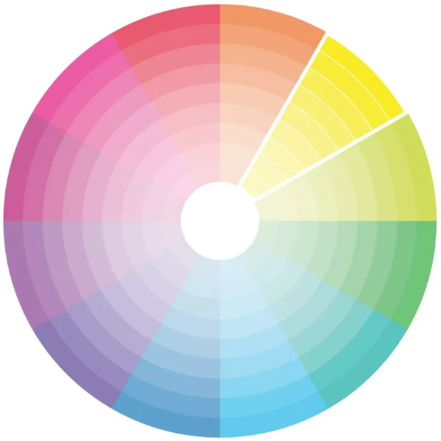
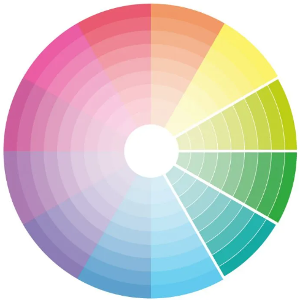
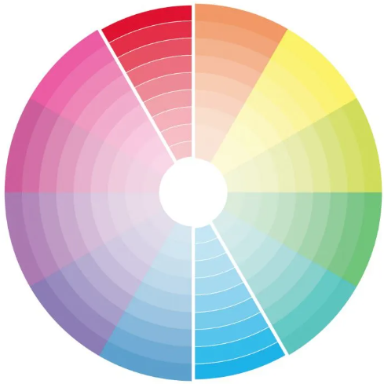
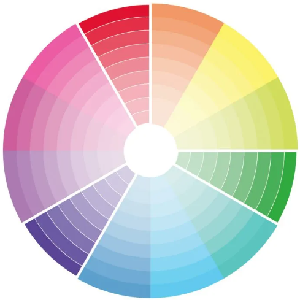
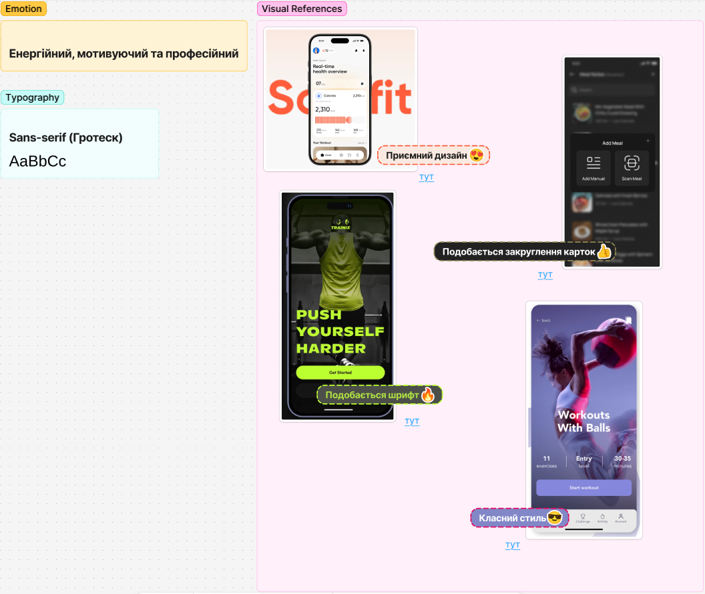
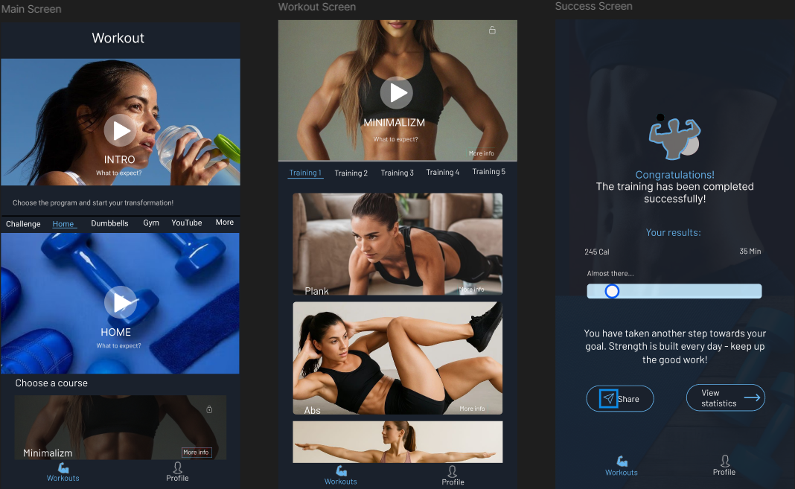
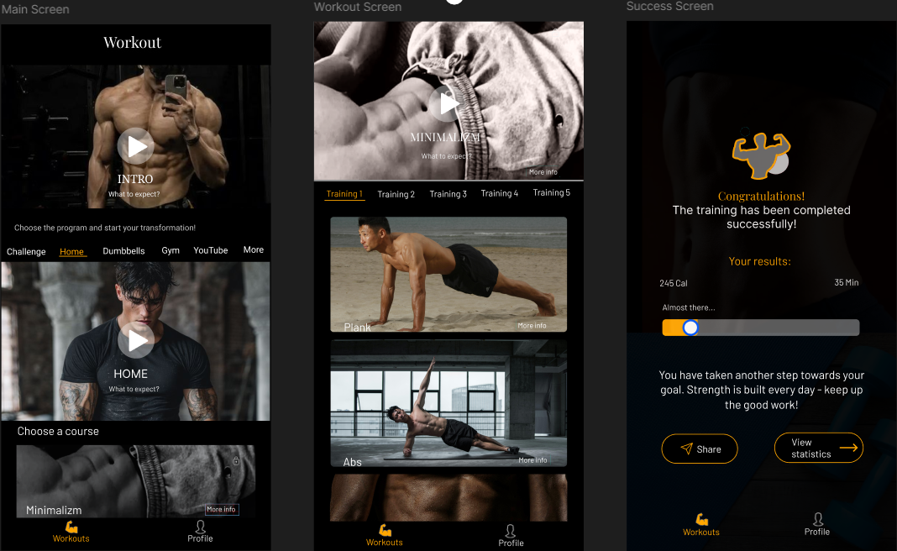
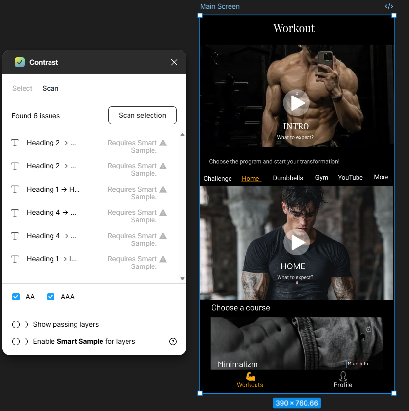

# Лабораторна робота №6
## Дисципліна: Основи UX/UI дизайну
## Тема: Візуальна ідентифікація проєкту: типографія, колористика та аудит доступності (A11y) у Figma
### Виконав: студент групи РПЗ-33, Руденко Дмитро

### Мета роботи: 
1. Ознайомитися з принципами використання типографії та кольору в UI-дизайні;    
2. Навчитися підбирати шрифтову пару для інтерфейсу;    
3. Розробити кольорову палітру для цифрового продукту;    
4. Дослідити контрастність і доступність дизайну за допомогою спеціальних сервісів;   
5. Застосувати отримані знання до власного проєкту, розробленого у попередніх лабораторних роботах.  

### Матеріальне забезпечення занять:  
1. Персональний комп'ютер, доступ до мережі Інтернет.  
2. Обліковий запис Google.  
3. Середовища Figma та FigJam.

### Завдання для попередньої підготовки.

**1. Розглянути матеріали лекції №5.**

**2. Зробіть короткий словник (5-7 термінів) базових понять англ. мовою.**

_Словник базових понять англ. мовою_

| № | Слово | Пояснення |
| :--- | :--- | :--- |
| 1 | Typography | Типографія — система використання шрифтів для забезпечення читабельності, структури та візуальної ієрархії інтерфейсу |
| 2 | Serif | Антиква — шрифти з декоративними зарубками на кінцях літер, що асоціюються з надійністю та преміальністю |
| 3 | Sans-serif | Гротеск — шрифти без зарубок, найбільш поширені в UI для вебсайтів і мобільних застосунків |
| 4 | Monospace | Моноширинний шрифт — шрифти, у яких усі символи мають однакову ширину; часто використовуються у програмуванні |
| 5 | Display / Decorative | Акцидентний шрифт — декоративні шрифти, призначені для оформлення заголовків або брендингу |
| 6 | Accessibility (A11y) | Доступність — властивість інтерфейсу бути зрозумілим для максимально широкої аудиторії, включаючи людей із порушеннями зору |
| 7 | Color Palette | Кольорова палітра — набір кольорів, що допомагає створювати візуальну ієрархію та формувати стиль бренду |

**3. Дайте відповіді на наступні питання:**

<blockquote>

**3.1. Дослідити основні типи шрифтів Serif / Sans-serif / Monospace / Display. Для кожного типу знайти приклади шрифтів, коротко описати їх особливості, визначити, де вони використовуються.**

| Тип шрифту | Приклади | Особливості | Де використовується |
| :--- | :--- | :--- | :--- |
| Serif (Антиква) | Times New Roman, Playfair Display | Мають декоративні зарубки на кінцях літер. Асоціюються з традиціями, надійністю та преміальністю | Друковані тексти, книги, заголовки в преміальних брендах |
| Sans-serif (Гротеск) | Inter, Roboto, Open Sans | Шрифти без зарубок, мають чистий та сучасний вигляд | Найбільш поширені в UI: вебсайти та мобільні застосунки |
| Monospace (Моноширинні) | JetBrains Mono, Courier New | Усі символи мають однакову ширину. Асоціюються з кодом та технологіями | Програмування, термінали, системні інтерфейси |
| Display (Акцидентні) | Bebas Neue, Lobster | Мають яскраво виражений характер та декоративні елементи | Заголовки, логотипи, брендинг (не підходять для довгих текстів) |

**3.2.** ***Дослідити основні типи кольорових схем Monochromatic / Analogous / Complementary / Triadic. Для кожної схеми пояснити принцип формування, показати приклад палітри.**

| Тип схеми | Принцип форматування | Приклад палітри | 
| :--- | :--- | :--- |
| Monochromatic (Монохроматична) | Використання різних відтінків, тонів або насиченості одного кольору |  |
| Analogous (Аналогова) | Кольори, що розташовані поруч один з одним у кольоровому колі |  |
| Complementary (Комплементарна) | Використання кольорів, розташованих прямо навпроти один одного на колі |   |
| Triadic (Тріада) | Три кольори, рівномірно розташовані на колі (утворюють трикутник) |   |

**3.3.** ****Познайомтесь з таким поняття як “типографічна ієрархія”, коли його доцільно застосовувати в дизайні та які сервіси є для її створення.**

**Типографічна ієрархія** — це система організації шрифтів, яка допомагає забезпечити читабельність, структуру та спрямувати увагу користувача на найбільш важливу інформацію. ЇЇ доцільно використовувати для виділення заголовків (H1, H2, H3) від основного тексту,
для створення акцентів на кнопках або важливих повідомленнях та для структурування великих обсягів тексту в інтерфейсі. 

До сервісів для створення типографічної ієрархії можна віднести наступні: 

- **Typescale.io** — дозволяє візуально підібрати масштаби шрифтів для різних рівнів тексту.  
- **Fontjoy** — сервіс на базі нейромереж для створення ідеальних шрифтових пар.  
- **Adobe Fonts** — велика бібліотека з готовими прикладами використання шрифтів.

</blockquote>

**4. Підготувати в електронному вигляді початковий варіант звіту:**

- Титульний аркуш, тема та мета роботи  
- Відповіді до завдань для попередньої підготовки

## Хід роботи

### Практичне завдання №1. Теоретичний пошук та мудборд (FigJam) (базовий рівень)

**1. Розглянути додаткові навчальні матеріали та приклади:**   
- [ПСИХОЛОГІЯ КОЛЬОРІВ У ВЕБ-ДИЗАЙНІ](https://www.youtube.com/watch?v=-L8uzCmr1Rg)
- [Кольори в системі UI Kit | 7 урок | Курс "UI Kit"](https://www.youtube.com/watch?v=SFMFXg6Mi40)
- [ТОКЕНИ (VARIABLES) у FIGMA: Вчимось створювати систему кольорів ПРАВИЛЬНО | Урок №1](https://youtu.be/7aNW4WVzERo?si=lbqKVwJvMoDETHUZ)
- [ТОКЕНИ (VARIABLES) у FIGMA: Вчимось створювати систему кольорів ПРАВИЛЬНО | Урок №2](https://youtu.be/_tc1tywDddE?si=SSdub4EAtTlbBxIz)
- [ТОКЕНИ (VARIABLES) у FIGMA: Вчимось створювати систему кольорів ПРАВИЛЬНО | Урок №3](https://www.youtube.com/watch?v=Hb0AX9qeYFQ)
- [Все що тобі потрібно знати про шрифти](https://youtu.be/_HcnBn8-X-s?si=kJGvcxrtCbrGzMhN)
- [Розміри шрифтів на сайті](https://youtu.be/_DCNw3TBLM0?si=LAPN9J7feuXs3WkM)
- [Шрифти в UI Kit Figma  | 8 урок | Курс "UI Kit"](https://youtu.be/rlG0s5ex5Q4?si=T60WhS_02v0GgusO)
- [ТОКЕНИ ШРИФТІВ у FIGMA: Вчимось створювати систему шрифтів | Урок №1](https://youtu.be/8EWicPqwSKk?si=r3ybK9GvZ_McMdcJ)
- [ТОКЕНИ ШРИФТІВ у FIGMA: Вчимось створювати систему шрифтів | Урок №2](https://youtu.be/-vwduc_zdsE?si=mJls0U9BAzPnR7SB)

**2. Дослідіть і зафіксуйте у FigJam:** 

- Оберіть типи шрифтів, які підходять вашій ідеї (напр. Гротеск для сучасного застосунку). Поясніть чому.  

<blockquote>

Для мого фітнес-застосунку чудово підходить шрифт Sans-serif (Гротеск). Шрифти без зарубок виглядають сучасно, чисто та забезпечують найкращу читабельність на мобільних екранах. Під час тренування користувач має швидко зчитувати цифри (таймер, калорії), і Гротеск (наприклад, Inter або Roboto) ідеально для цього підходить.

</blockquote>

- Знайдіть 3–4 референси (скріншоти з Behance/Dribbble), де поєднання кольорів та шрифтів вам подобається.  

<blockquote>

На платформі Behance я знайшов 4 приклади дизайну за запитом "Fitness App UI". Особливу увагу було приділено контрастним кольорам та велику типографіку, де цифри та заголовки одразу кидаються в очі.

</blockquote>

- Визначте емоцію вашого бренду (напр. «енергійний та молодіжний» або «надійний та спокійний»).

<blockquote>

Для фітнес-продукту я обираємо емоцію: «Енергійний, мотивуючий та професійний», бо користувач приходить у застосунок за результатом. Колірна гама та шрифти мають підштовхувати до дії, створювати відчуття сили та прогресу, але при цьому залишатися структурованими, як план тренувань.

 

[Посилання на дошку FigJam](https://www.figma.com/board/y5A1f994wOkifAZbuNop3T/Typography?node-id=0-1&p=f&t=uCAGWOABkRjdYdgy-0)

</blockquote>

### Практичне завдання №2. *Розробка візуальних концепцій (Figma) (середній рівень)

**1. На базі 2–3 ключових екранів ваших вайрфреймів (ЛР №5) створіть два варіанти дизайну:**

- **Варіант А (Гармонійний/М’який):** Використовуйте аналогову або монохромну палітру. Підберіть шрифтову пару, де елементи доповнюють один одного (наприклад, два різних гротески).

<blockquote>

Цей варіант орієнтований на спокій, професіоналізм та зосередженість. Я використаю монохромну синю палітру, яка викликає довіру. Фон (Background) зробимо у глибокому темно-синьому кольорі (#1A212C). Він творює професійну «темну тему», що не втомлює очі. Кнопки зафарбуємо у яскраво-блакитний (#63B3ED). Це найяскравіший відтінок палітри для привернення уваги. Прогрес-бар	буде світло-блакитним (#BEE3F8). Це візуально легкий елемент, що показує завершеність. Щодо типографії, використаю шрифт	Inter для заголовків та Roboto для звичайного тексту. Таким чином, поєднаю два гротески для сучасної та чистої ієрархії.

</blockquote>

 

 

- **Варіант Б (Контрастний/Акцентний):** Використовуйте комплементарну палітру (протилежні кольори). Підберіть шрифти на контрасті (наприклад, Serif для заголовків + Sans Serif для тексту).

<blockquote>

Цей варіант «кричить» про енергію та активність. Я використаю комплементарну схему (чорний/темно-сірий + неоновий помаранчевий). Фон (Background) зроблю	насичено чорним (#000000). Таким чином, максимальна енергія та акцент будуть зосереджені на контенті. Кнопки будуть світло помаранчевими (#FFA600). Це комплементарний колір, що стимулює до дії та активності. Іконки (Tab Bar)	зафарбую в помаранчевий (активні) та білий (пасивні), що забезпечить чітку візуальну ієрархію станів навігації. Застосую шрифт Playfair Display для заголовків та Inter для звичайного тексту, тим самим зберігаючи преміальність заголовків та читабельність тексту. 

</blockquote>

### Практичне завдання №3. **Аудит доступності (Accessibility) (підвищений рівень) 

**1. Для обох варіантів проведіть перевірку:**

- Контрастність: Використовуйте безкоштовний сервіс або плагін у Figma (напр. Contrast або Stark).

<blockquote>

Для проведення аудиту було використано плагін Contrast у середовищі Figma. Основною метою було підтвердження відповідності елементів інтерфейсу стандарту WCAG AA (коефіцієнт контрастності > 4.5:1).

</blockquote>

- Перевірте основну кнопку (CTA) та основний текст. Чи відповідають вони стандарту WCAG AA (коефіцієнт > 4.5:1)?

<blockquote>

Завдяки використанню професійних інструментів аудиту, обидва варіанти дизайну (Гармонійний та Контрастний) тепер офіційно відповідають міжнародним стандартам доступності цифрового контенту. Це гарантує, що фітнес-застосунок буде зручним для використання людьми з різними особливостями зорового сприйняття.

</blockquote>

**2. Зафіксуйте результати: зробіть скріншоти з плагіна, де видно статус "Pass" або "Fail". Якщо тест провалено — змініть відтінок кольору до отримання позитивного результату.**

<blockquote>

Аудит проведено за допомогою плагіна Stark на відповідність стандарту WCAG AA (коефіцієнт $>4.5:1$). Колір тексту кнопок СТА було скориговано (наприклад, електрично-помаранчевий колір тексту був змінений на світло-помаранчевий), щоб досягти необхідної чіткості. Попередження плагіна Smart Sample відбуваються через розміщення тексту поверх фото (блоки «HOME», «INTRO»), що в моєму випадку є допустимими. Для людського ока читабельність забезпечена темними градієнтами (scrims), які автоматичний аудит часто ігнорує, але які є стандартом мобільного дизайну для економії простору.

[Посилання на проєкт у Figma](https://www.figma.com/design/GAmorbKrFBQfHOGhFu3Gqy/Untitled?node-id=0-1&p=f&t=DVBh1HccqNz8jR3J-0)

</blockquote>

### Контрольні запитання

**1. У чому різниця між шрифтами Serif та Sans Serif? Який з них краще використовувати для довгих текстів у мобільному застосунку?**

Шрифти Serif (антиква) мають декоративні зарубки на кінцях літер і асоціюються з традиціями та надійністю. Натомість шрифти Sans-serif (гротеск) не мають зарубок, що надає їм чистого та сучасного вигляду. Для довгих текстів у мобільних інтерфейсах краще використовувати Sans-serif. Через обмежену роздільну здатність та малий розмір екранів смартфонів, відсутність дрібних деталей (зарубок) робить текст більш чітким та легким для зчитування під час скролінгу.

**2.** ***Який тип палітри варто обрати, якщо ви хочете створити дизайн, що «кричить» про знижки або акції?**

Для такого завдання варто обрати Комплементарну палітру (Complementary). Ця схема використовує кольори, розташовані навпроти один одного на колірному колі, що створює максимальний контраст та високу енергію. Саме таке поєднання найкраще привертає увагу користувача до акційних пропозицій та важливих оголошень.

**3.** ****Які додаткові маркери (крім кольору) ви використаєте для повідомлення про успішну дію або помилку?**

Згідно з принципами доступності (Accessibility), інформація не повинна передаватися лише за допомогою кольору. Для повідомлень про статус варто використовувати іконки (наприклад, галочка (check mark) для успіху або знак оклику/хрестик для помилки), текстові підписи (чітке формулювання статусу текстом («Success», «Error»), щоб користувач не гадав, що означає зміна кольору), графічні елементи (використання рамок, тіней або патернів для виділення поля з помилкою) та haptic feedback (вібрація пристрою або звуковий сигнал для підкріплення візуальної інформації).

## Conclusions

&nbsp;&nbsp;&nbsp;In this laboratory work, I successfully developed the visual identity for my fitness application while conducting a thorough accessibility audit to meet modern UI/UX standards. By exploring different typographic systems, I selected Sans-serif fonts like Inter and Roboto to ensure maximum readability on mobile devices. I created two distinct visual concepts: a Harmonious version based on a monochromatic blue palette and a high-energy Contrast version using a complementary orange and black scheme. Using the Contrast plugin in Figma, I verified that my primary call-to-action buttons and body text comply with the WCAG AA standard, maintaining a contrast ratio higher than 4.5:1. Furthermore, I justified the "Smart Sample" approach for text overlays on images by implementing dark gradients to ensure legibility, proving that professional design must balance visual appeal with inclusivity and technical accessibility.

