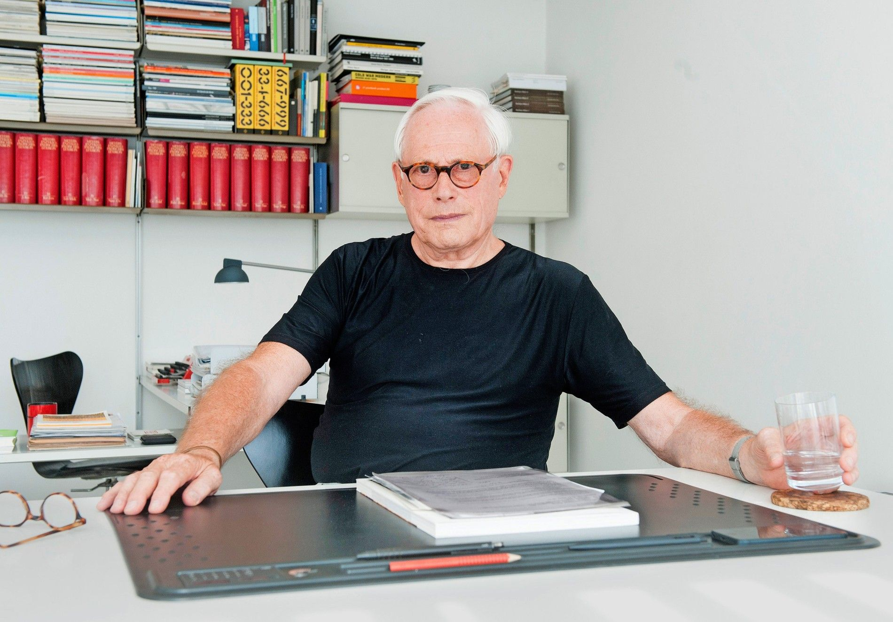
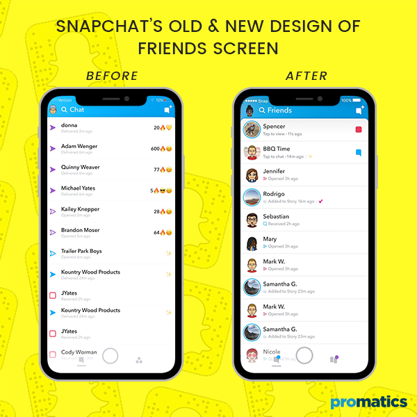
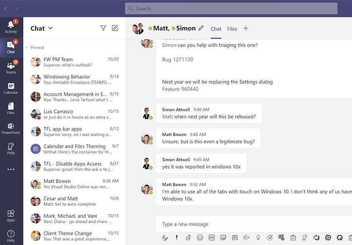
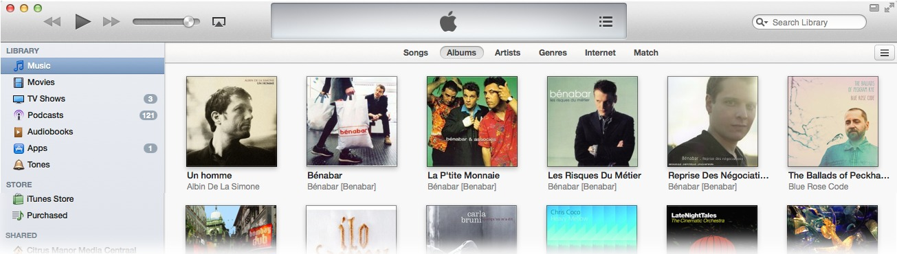

# Самостійна робота студента.
## Виконав: студент групи РПЗ-33, Руденко Дмитро

## 1. Контрольні запитання:
- **Що таке дизайн у широкому сенсі?**

   *__Дизайн__ - це процес проєктування об'єкта або системи для вирішення конкретних задач, включаючи естетичні, функціональні, технічні та соціальні аспекти.*

- **Поясніть різницю між UI та UX на прикладі ліфта (кнопки, панель, логіка руху).**

  *До __UI__ дизайну можна віднести матеріал, зовнішній вигляд ліфта, включаючи кнопки, панелі та стиль, в якому він виконаний.       
  До __UX__ дизайну буде належати логіка руху ліфта, його безпека, надійність та зручність у використанні.*

- **Які обмеження накладає сенсорний екран смартфона порівняно з монітором ПК?**

   *Сенсорний екран обмежує дизайн через низьку точність пальця, потребуючи великих кнопок. Відсутність ефекту наведення та перекриття контенту рукою під час дотику
змушує виносити елементи керування в нижню зону досяжності великого пальця та відмовлятися від складних вкладених меню на користь вертикального використання пристрою.*

- **Що таке «афорданс» в інтерфейсі?**

   *__Афорданс__ — це візуальна підказка, яка пояснює користувачеві, як взаємодіяти з об'єктом. В інтерфейсах це властивості дизайну, що натякають на функцію.
Це пряма залежність між зовнішнім виглядом та дією, що робить UI інтуїтивно зрозумілим без інструкцій (наприклад, опукла форма кнопки спонукає до натискання на неї,
іконка кошика афордує видалення тощо).*

- **Як можна класифікувати інтерфейси?**
  
  *__1) Механічний інтерфейс__. Мікрохвильова піч: дверцята з вікном та ручкою, ручка потужності та таймер, індикатор роботи (світло).*  
  *__2) Графічний інтерфейс__. Вебсайти, мобільні додатки (адаптовані під сенсорний екран), програми для ПК (клавіатура, миша).*   
  *__3) Командний рядок__. Символьний інтерфейс (CLI), MS-DOS, Linux термінал.*  
  *__4) Жестовий та сенсорний інтерфейс__. Мультимедійні панелі, смартфони.*  
  *__5) Голосовий інтерфейс__. Siri, Alexa.*  
  *__6) Нейроінтерфейс__. Neuralink (керування мозком).*   
   
## 2. Питання на дослідження
- **Охарактеризувати 10 принципів хорошого дизайну за Дітером Рамсом та навести приклади.**

  
  
  **_1. Гарний дизайн - інноваційний дизайн._**
  
  *Дизайнери мають розуміти та використовувати новітні технології для створення нових рішень, які відповідатимуть потребам і бажанням користувачів.
  Наприклад, інноваційний дизайн може допомогти створити простіші у використанні, більш інтуїтивно зрозумілі та більш екологічні продукти. Дизайнери повинні вміти визначати можливості для інновацій і перетворювати їх на значущі рішення.*

  **_2. Гарний дизайн робить продукт корисним._**

  *Корисним скоріш за все буде сприйматись простий у використанні, ефективний, функціональний, зручний і приємний продукт. Наприклад, смартфон, яким легко керувати, який зручно тримати в руці,
  який має привабливий дизайн. Це є прямим прикладом корисного продукту.*

  **_3. Гарний дизайн — естетичний._**

  *Естетичний аспект дизайну є критично важливим, оскільки він впливає на наше сприйняття та взаємодію з продуктом, яким користуємося щодня. Наприклад, кавова чашка з гарним дизайном, яку зручно тримати в руках — виглядає привабливо,
  отже, може зробити наш ранковий ритуал кави більш приємним і розслабляючим.*

  **_4. Гарний дизайн робить продукт зрозумілим._**

  *Хороший дизайн робить продукт зрозумілим, прояснюючи його структуру та полегшуючи взаємодію з ним. Це надзвичайно важливо, тому що продукт, який важко зрозуміти, може розчарувати і бути неефективним, тоді як продукт, який легко зрозуміти, може бути менш функціональним, але більш ефективним саме для користувача. Наприклад, приладова панель автомобіля, яка використовує чіткі значки та дисплеї для відображення швидкості автомобіля та рівня палива, набагато ефективніша, ніж та, яка показує лише цифри та прилади.*

  **_5. Гарний дизайн — ненав'язливий._**

  *Дизайн продукту повинен бути нейтральним і стриманим, дозволяючи користувачеві зосередитися на власних потребах і цілях. Чудовим прикладом ненав'язливого дизайну є скромний олівець. Олівець - простий інструмент, яким ми пишемо чи малюємо. Дизайн олівця мінімальний, з довгим тонким корпусом і маленькою гумкою на одному кінці. Колір і обробка олівця можуть відрізнятися, але в цілому дизайн простий і ненав'язливий, що дозволяє користувачеві зосередитися на роботі.*

  **_6. Гарний дизайн — чесний._**

  *Чесність і прозорість зміцнюють довіру та допомагають встановити міцні стосунки між споживачем і брендом. Зосереджуючись на справжніх перевагах продукту, компанії можуть створювати продукти, які витримують випробування часом, і підтримуватимуть базу лояльних клієнтів.*

  **_7. Гарний дизайн — довготривалий._**

  *Хороший дизайн не прив'язаний до якоїсь епохи чи течії. Він поза часом і може залишатися актуальним десятиліттями, а то й століттями. Прикладом може слугувати крісло Eames Lounge або Volkswagen Beetle, виготовлені в класичному дизайні. Ці конструкції зберігаються десятиліттями, тому що вони не тільки стильні, але й функціональні та добре виготовлені.*

  **_8. Гарний дизайн продуманий до деталей._**

  *Це означає, що враховано буде абсолютно все. Жодна деталь не буде пропущена чи упущена. Процес проєктування має бути ретельним і точним, враховуючи всі можливі фактори, які могли б вплинути на продукт. Така скрупульозність допоможе покращити загальну якість продукту.*

  **_9. Гарний дизайн — екологічний._**

  *Дизайнери мають враховувати вплив продукції на навколишнє середовище. Використані матеріали, виробничий процес, споживана енергія та утилізація виробу після використання – все це важливі аспекти. Мета полягає в мінімізації негативного впливу на навколишнє середовище протягом усього життєвого циклу продукту. Наприклад, дизайнери можуть створювати продукти, які потребують менше енергії для виробництва, транспортування та використання.*

  **_10. Гарний дизайн – це якомога менше дизайну._**

  *Гарний дизайн — це не лише про додавання елементів до продукту, а й усунення непотрібних функцій. Цей принцип відомий як «менше — це більше». Це означає, що дизайн продукту має бути простим і зосередженим на його основних функціях.*
  
- **Проаналізувати особливості дизайну для людей з різними порушеннями (Accessibility) в контексті поточної ситуації в Україні.**

  **_Порушення моторики та фізичні травми._**

  *Слід збільшити клікабельні зони (навіть понад стандартні 44х44 px) та забезпечити підтримку керування лише клавіатурою або голосом, мінімізувати залежність від складних жестів.*

  **_Зорові та когнітивні порушення._**

  *Максималізувати контрастність тексту, відмовитись від агресивної анімації та забезпечити спрощену навігацію, чітку ієрархію заголовків для скрінрідерів.*

  **_Технічні обмеження._**

  *Забезпечити "легкий" дизайн, що швидко вантажиться при низькій швидкості з підтримкою темної теми задля економії заряду смартфона.*
  
- **Підготувати приклади невдалих інтерфейсних рішень у популярних програмах (2-3 приклади).**

  _**Snapchat.**. Проблема полягала у відсутності чітких підказок для знаходження повідомлень, історій чи налаштувань на головному екрані. Як наслідок, нові користувачі часто губилися, а оновлення 2018 року викликало масове невдоволення й навіть падіння активності. З цього можна зробити висновок, що інтерфейс має бути інтуїтивним, особливо для нових користувачів._

  _**Microsoft Teams.**. Надмірна кількість вкладок, кнопок і повідомлень на одному екрані в ранніх версіях програми. Користувачі скаржилися на складність пошуку потрібних функцій, а новачки витрачали багато часу на освоєння. Отже, важливо уникати інформаційного шуму та забезпечувати просту ієрархію._

  _**iTunes.**. Програма поєднувала купівлю музики, управління бібліотекою, синхронізацію з пристроями й стрімінг — усе в одному інтерфейсі. В наслідку користувачі часто плуталися, де саме знайти потрібну функцію, а інтерфейс здавався перевантаженим і застарілим. Краще розділяти різні завдання на окремі сервіси або модулі._

- **Опишіть кожен з представлених 6 видів UI-інтерфейсів та наведіть приклади, де вони використовуються в ІТ-індустрії.**

  *__1) CLI (Command Line Interface)__. Чорний екран, білий текст, потрібно знати команди на пам'ять. Це найбільш ефективний метод для системного адміністрування та програмування, що забезпечує прямий доступ до системних ресурсів через текстовий ввід (Terminal, Git, SQL).*
  
  *__2) GUI (Graphical User Interface)__. Вікна, іконки, курсор, тобто метафора робочого столу. Базується на візуальному поданні функцій через графічні елементи, що дозволяє користувачу взаємодіяти з програмами без знання спеціального коду (ОС Windows, Photoshop, Figma).*
  
  *__3) NUI (Natural User Interface)__. Інтерфейси, які імітують природну взаємодію, вони використовують жести тіла, рухи пальців або розпізнавання обличчя, роблячи технології непомітними та інтуїтивно зрозумілими для кожного (сенсорні екрани Touch, цифрові помічники Siri, Alexa та VR/AR).*
   
  *__4) VUI (Voice User Interface)__. Взаємодія виключно через голос, дозволяє керувати системою, коли руки або очі зайняті, використовуючи алгоритми обробки природної мови для перетворення команд у дії (Google Assistant, розумні колонки).*  

  *__5) WUI (Web User Interface)__. Графічний інтерфейс, адаптований під роботу в браузерах. Він забезпечує доступ до сервісів через інтернет без необхідності встановлення софту на ПК, фокусуючись на адаптивності під різні розміри екранів (інтернет-магазини, хмарні сервіси, ваші проекти PWA-додатків).*  

  *__6) OUI (Organic User Interface)__. Інтерфейси на гнучких поверхнях, що можуть змінювати фізичну форму. Вони дозволяють дисплею або корпусу пристрою згинатися, скручуватися або розтягуватися, підлаштовуючись під анатомію людини або конкретну задачу (смартфони з гнучким екраном, «розумні» тканини).*
