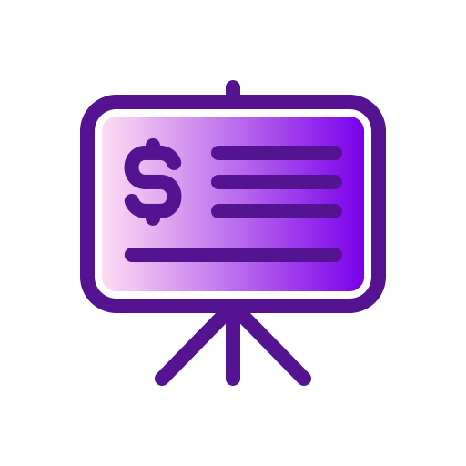
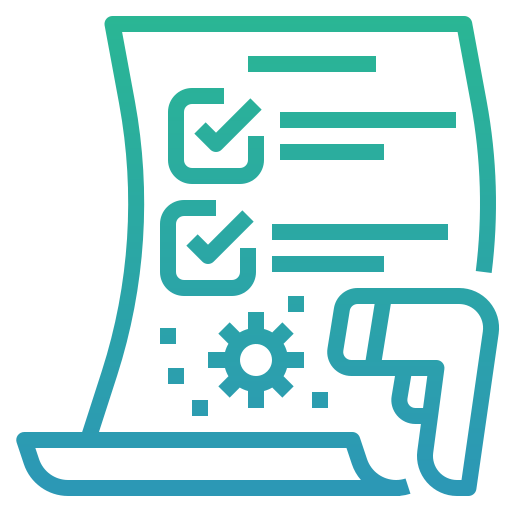

# Самостійна робота студента.
## Виконав: студент групи РПЗ-33, Руденко Дмитро

## 1. Контрольні запитання:
 
- **Чим відрізняється вебсайт від вебзастосунку?**

 

  
  

  **Вебсайт** - це переважно набір статичних сторінок для надання інформації. Тобто людина просто споглядає та знайомиться з певною інформацією і від неї не вимагається активності. Прикладом може слугувати блог, сайт-візитівка тощо.
  Говороячи про **вебзастосунок**, він передбачає тісну взаємодію з користувачем, обробку даних та реакцію системи на дії людини. Тобто користувач не тільки споглядає, а й виконує певні дії. Це може бути генератор логотипів, онлайн-банкінг, соціальна мережа тощо. 

- **Які етапи життєвого циклу вебпроєкту є критичними для UX/UI дизайнера?**

  Етап 1. Аналітика, збір інформації, написання технічого завдання.  

 
 
  _Перед початком розробки ризикованого проєкту є сенс провести дослідження ринку, спробувавши проаналізувати конкурентів, спрогнозувати прибуток. Цим займаються як бізнес-аналітики, так і консалтингові компанії. Часто аналізом та збиранням інформації про проєкт
  займається UX-дизайнер. Цей етап здебільшого характерний для високобюджетних проєктів. В результаті пишеться технічне завдання, що представляє собою докладний опис вимог та необхідних функцій, які повинен мати вебсайт після закінчення розробки. Досить часто для
  написання подібних завдань вводяться такі посади, як менеджер проєктів та product owner._
  
  Етап 2. Пошук референсів, створення мудбордів.

  
  
  _Коли концепцію створено, технічне завдання передається UX/UI дизайнеру для пошуку UX-рішень і візуального стилю. Для цього часто використовують такі сайти, як Behance та Dribbble. Коли UX/UI-дизайнер вже набрав певний ряд ідей, він створює так званий moodboard, що     представляє собою певну колекцію рішень, на основі яких формується подальший дизайн. Мудборди створюються для того, щоб мати змогу показати певні варіанти рішень замовнику, щоб він обрав те, що йому до вподоби. Цей етап дозволяє заощадити час і пропустити багато        невдалих спроб по знаходженню відповідного візуального стилю._

  _В деякій літературі дослідження та стратегія поєднуються у спільну фазу, де ми фактично визначаємо ідею і приблизний напрямок її реалізації. Роль UX-дизайнера у співпраці з бізнес-аналітиком тут полягає у
  формуванні "Портрету користувача", тобто хто буде користуватись застосунком._
  
  Етап 3. UX-дизайн.

  
  
  _На цьому етапі UX-дизайнер починає пропрацьовувати досвід користувача. Тобто він має продумати як користувач буде крок за кроком працювати з системою. Тут з досить типових інструментів можна виокремити так звані user stories, які дозволяють зрозуміти хто і як буде    користуватись вебсайтом або вебзастосунком і прописати кожну функцію у вигляді послідовності дій. Далі на основі user stories вебсайти розбиваються на певні послідовності екранів і схем, тобто формується логіка переходів у застосунку. Далі потрібно відмалювати скетчі   екранів, де в примітивному вигляді представляються розташування елементів меню, яке буде в прототипі застосунку. Також на цьому кроці можуть створюватися інтерактивні екрани, які будуть показувати принцип реалізації меню. Це дозволяє якісніше сформувати переходи та     виявити, які проблеми в інтерфейсі можуть виникнути у користувачів._
  
  Етап 4. UI-дизайн.

  
  
  _На цьому етапі на основі скетчів екранів, які зробив UX-дизайнер, відбувається пошук візуального стилю, підбирається кольорова гама, шрифти, іконки, вибудовується сітка та відмальовуються ключові скетчі з попереднього етапу.
  На основі створених мудбордів замовнику пропонується певний стиль вже націленого застосунку та відбувається його затвердження або корегування. Важливо розуміти, що на цьому етапі вирішується, як має виглядати сайт після завершення розробки (на відміну від               попереднього етапу, де визначалася структура кожного екрана)._

  Етап 5. Презентація проєкту.

  

  _Відбувається підготовка певного прототипу для нашого рішення, який не передбачає повністю весь функціонал, тобто в інтерактивному форматі демонструється якийсь окремий базовий елемент (головне меню, один з варіантів пошуку тощо) для складання певного враження у       замовника щодо того, як буде працювати система. На основі того, чи сподобався замовнику прототип, відбувається перехід до процесу розробки._

  _Досить часто в літературі UX-дослідження, створення інтерфейсу (UI) і прототипування вводять у спільну фазу, яку називають
 Дизайном (Design). Спочатку створюються чорно-білі схеми (Wireframes) з розташуванням основних блоків інтерфейсу. Потім ми створюємо кольорові макети (Mackups) інтерфейсу, після чого створюємо певну клікабельну модель (Interactive Prototypes). Маючи ці три складові можлива подальша розробка основної частини продукту._

  Етап 6. Експорт ресурсів.

  
  
  _Після успішної презентації та затвердження проєкт переходить у стадію верстки та програмування. Вони можуть виконуватись паралельно. Щоб почати верстати Frontend-розробникам потрібні всі іконки, картинки, ілюстрації в окремих файлах, які називають ресурсами.          Підготовку та експорт ресурсів виконує UX/UI-дизайнер._

  Етап 7. Верстка (HTML/CSS/JS).

  
  
  

    
  _Сам процес верстки є написанням коду для створення статичних сторінок, тобто де немає складних переходів між екранами, але пропрацьовується дизайн окремо взятої сторінки. Вони зазвичай відкриваються у браузері, де можна подивитись на зовнішній вигляд, але при         натисканні на певні кнопки чи посилання нічого не відбудеться. Для створення верстки використовуються по класиці HTML, CSS, та JS._

  _**HTML (HyperText Markup Language)** — мова гіпертекстової розмітки, за допомогою якої задаються елементи веб-сторінки та її вміст;   
 **CSS (Cascading Style Sheets)** — каскадні таблиці стилів, за допомогою яких задається зовнішній вигляд елементів, які ми створили за допомогою HTML;     
 **JS (JavaScript)** — мова програмування, за допомогою якої можна «оживити» деякі елементи інтерфейсу: додати мікроанімацію, змусити працювати слайдер і так далі._

  _Для того, щоб зробити верстку більш цікавою, з часом почали з'являтися так звані frontend-фреймворки. Вони характеризуються певним набором готових до використання компонентів, де вже HTML, CSS та JS між собою поєднані і ми можемо їх використовувати як готові шаблони.  Досить поширеним зараз є **Bootstrap** - фреймворк, який дозволяє використовувати різні шаблони для оформлення різноманітних вебформ, кнопок, міток, типографіки, блоків навігації тощо._

  Етап 8. Програмування.

  
  
  _Програмісти або backend-розробники займаються створенням функціональної частини сайту, всього того, що змушує працювати елементи лицьової панелі (frontend). Вся ця система невидима і захована всередині, але саме вона дозволяє вебсайту реагувати на дії користувачів.
 Тут є різні варіанти застосування технологій, зокрема:_

  _**HTML, CSS & JS** — все те, що використовують верстальники;   
 **PHP (Hypertext Preprocessor)** — мова програмування, що широко використовується для розробки вебдодатків. Мова PHP дозволяє динамічно генерувати HTML–код, у відповідь на обставини, що склалися, і дії користувачів;   
 **MySQL** — система керування базами даних. Дозволяє веб-сайтам зберігати та обробляти інформацію. Наприклад, облікові записи користувачів та їх повідомлення у соціальній мережі зберігаються у базах даних._

  _Фактично, етап розробки, куди входить верстка та backend-частина, входить до третьої фази, яка називається **фазою розробки (Development)**. Вона містить 3 елементи:_

  _1) **Handoff (Передача в розробку)**: Дизайнер не просто кидає картинку. Він готує Design System (бібліотеку компонентів), експортує іконки в SVG, прописує стани кнопок (hover, active, disabled);   
  2) **Frontend (Лицьова панель)**: HTML (скелет), CSS (шкіра), JS (м'язи);   
  3) **Backend (Мозок)**: Серверна частина._

  Етап 9. Тестування.

 
 
  _Коли функціонал прописано виникає потреба в його тестуванні. Сюди входять такі ролі як QA-фахівці - тестувальники, які дивляться на інтерфейс, запускають його і досліджують. Поділяють **ручне тестування** - коли тестувальник запускає сайт та проходить по всім     сценаріям користувачів, намагаючись виявити якісь помилки у роботі; фактично він отримує завдання від UX-дизайнера на рахунок того, що потрібно пройти та які моделі поведінки переглянути. Та **автоматичне тестування** - QA-спеціаліст пише скрипт, який запускає браузер та виконує всі дії замість людини. Також є **бетатестування** - коли ми залучаємо певний відсоток звичайних користувачів для виявлення можливих помилок, що лишилися._

  Етап 10. Розгортання вебсайту (Deploy).

 
 
  _Це процес перенесення та запуску сайту на сервері в мережі Інтернет. Справа в тому, що розробка сайту виконується локально. Тобто сайт, який розробляється не доступний в Інтернеті взагалі.
  Сюди залучаються адміністратори та devops-інженери, які забезпечують безперебійну роботу вебсайту. В більшості ці роботи виконуються в терміналі, який використовує символьний графічний інтерфейс._

  _Етапи тестування та розгортання поєднують в четверту фазу. Тут дизайнер перевіряє роботу програмістів, де дивиться чи збігається верстка на 100% з макетом (Pixel Perfect). Сайт стає доступним за посиланням (доменом), тобто відкритий для загального використання._

- **У чому полягає цінність прототипування?**

  Це важливий елемент розробки, який відбувається на п'ятому етапі. Він передбачає створення прототипу для певного рішення, не використовуючи повністю весь функціонал для демонстрації окремих базових елментів (головне меню тощо). Це необхідно, бо дає змогу скласти загальне враження у замовника щодо того, як буде працювати система. Подальшьий процес розробки залежить саме від того, чи сподобався замовнику прототип.
  
- **У чому різниця між UX Researcher та UI Designer?**

  **UX Researcher (Дослідник)** - це людина, яка досліджує цифри та враховує психологію. Такий спеціаліст не малює картинки, а проводить інтерв'ю, будує гіпотези, розуміє хто буде користувачем продукту, тобто проводить певну аналітику стосовно того, хто такий користувач і як він буде користуватись розробкою. З іншої сторони, **UI-дизайнер** є візуалізатором, тобто він відповідає за естетику та емоції, які будуть виникати у користувача в ході роботи з інтерфейсом. Його задача - підібрати якісно кольори, типографіку, сітки, стан кнопок (активна/неактивна) тощо.
  
- **Поясніть різницю між Frontend та Backend простими словами?**

  Frontend відповідає за візуальну частину, тобто те, що бачить користувач під час взаємодії з інтерфейсом. Backend на противагу Фронтенду є невидимою частиною програми, але він відповідає за функціонал, тобто дії, які будуть відбуватися під час взаємодії з Фронтенд-елементами.

# 2. Питання на дослідження

- **Розкрийте поняття SDLC (Software Development Life Cycle) на прикладі розробки мобільної гри.**

 
 
  **SDLC (Software Development Life Cycle)** — це життєвий цикл розробки програмного забезпечення, який описує всі етапи створення продукту: від ідеї до підтримки. У контексті створення мобільної гри, можемо виокремити такі етапи:

1. **Аналіз та планування**. На початку проводиться дослідження ринку ігор, аналіз конкурентів та прогнозування прибутку. Потім формується технічне завдання (Game Design Document), де описуються механіки, жанр та вимоги до гри.
2. **Дизайн**. Зі сторони UX-дизайну продумується логіка меню, шлях гравця (User Stories), створюються схеми переходів між рівнями. Щодо UI, відбувається розробка візуального стилю гри, малюються кнопки, іконки, підбираються шрифти та створюються мудборди для затвердження атмосфери.   
3. **Розробка**. Frontend-розробники, які відповідають за клієнтську частину, створюють ігрові сцени, анімації, відбувається верстка інтерфейсу (аналогічно до HTML/CSS/JS, але часто в ігрових рушіях). Щодо Backend-частини, тут пишеться код для збереження прогресу гравців, таблиці рекордів, мультиплеєра тощо.   
4. **Тестування**. QA-фахівці перевіряють гру на баги, проводять бета-тестування на реальних гравцях.   
5. **Реліз та підтримка**. Деплой гри (публікація в App Store/Google Play) та подальша технічна підтримка.
    
- **Побудуйте схему життєвого циклу вебпроєкту з позначенням ролі UX/UI дизайнера на відповідних етапах.**
  
1. **Аналітика та написання технічного завдання.** Роль UX/UI-дизайнерів на цьому етапі полягає у зборі інформації про проєкт, аналізі конкурентів, формуванні "Портрету користувача".    
2. **Пошук рішень.** Тут UX/UI-дизайнери шукають референси (Behance/Dribbble), створюють Moodboard, визначають візуальний 
напрямок.   
3. **UX-дизайн (Проєктування).** Створюються User Stories, Wireframes (схеми екранів), інтерактивні прототипи, розробляються логіки переходів.  
4. **UI-дизайн (Візуалізація).** Відбувається підбір кольорів, шрифтів, будуються сітки, створюються кольорові макети (Mockups).  
5. **Презентація.** Роль UX/UI полягає у створенні демо-прототипу для показу замовнику базового функціоналу.  
6. **Експорт ресурсів (Handoff)**. Підготовка Design System, експорт іконок/картинок, опис станів кнопок (hover/active) для розробників.   
7. **Розробка (Верстка/Backend).** Консультація розробників (авторський нагляд).  
8. **Тестування та Деплой.** Відбувається перевірка Pixel Perfect (чи збігається верстка з макетом на 100%).
   
- **Дослідіть поняття T-shaped skills для сучасних ІТ-спеціаліста з розробки ПЗ.**

  Поняття T-shaped skills описує фахівця, який має глибоку експертизу в одній сфері (вертикальна паличка) та базові знання в суміжних областях (горизонтальна паличка). До **глибоких знань** можна віднести такі навички, як побудова User Stories, Wireframes, Prototyping.  Також сюди входить робота з візуальним дизайном (композиція, кольористика, типографіка) та з інструментами дизайну (Figma, Sketch тощо). До **суміжних навичок** можна віднести бізнес-аналіз (вміння аналізувати ринок та конкурентів, розуміння бізнес-цілей), розуміння Frontend (знання того, як верстається сайт (HTML/CSS), як працюють фреймворки (Bootstrap), щоб не намалювати те, що неможливо реалізувати), а також копірайтинг/маркетинг (розуміння психології користувача для написання текстів в інтерфейсі). Також до горизонтальної палички можна віднести QA (Тестування), як вміння перевірити реалізований інтерфейс на відповідність макету (Pixel Perfect).

- **Знайти на сайтах пошуку роботи (Djinni, Work.ua) 2 вакансії: "UI/UX Designer" та "Web Designer". Порівняти вимоги до Hard Skills.**

  | Характеристика | UI/UX Designer | Web Designer |
  | :--- | :--- | :--- |
  | Основні вимоги | Проєктування зручності та логіки (UX) + візуал (UI) | Створення візуального вигляду вебсторінок (часто рекламних або лендінгів) |
  | Hard Skills | Figma (досконало: компоненти, Auto Layout), Prototyping tools | Figma, Photoshop, Illustrator (більший акцент на графіку) |
  | Аналітика | Вміння складати User Stories, проводити User Research, будувати CJM (Customer Journey Map) | Зазвичай не вимагається глибока аналітика користувачів |
  | Проєктування| Створення Wireframes (каркасів), складної логіки переходів та інтерактивних прототипів | Створення макетів окремих сторінок, банерів, іноді логотипів |
  | Технічні знання | Розуміння Design Systems, станів елементів (hover/active), підготовка до Handoff | Базові знання HTML/CSS (часто вимагають вміння самому зверстати простий сайт) |
  | Ключова відмінність | Відповідає за те, як працює продукт і як виглядає | Відповідає переважно за те, як виглядає продукт (естетика) |
  
