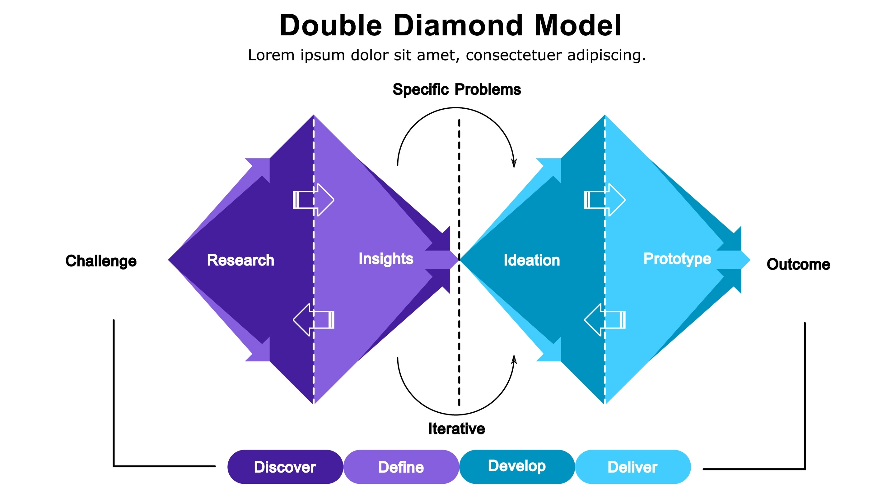

# Самостійна робота студента.
## Виконав: студент групи РПЗ-33, Руденко Дмитро

 
  
## 1. Контрольні запитання:
  
- #### Яке призначення Problem Statement?
  
  Problem Statement полягає у формуванні проблем. На цьому етапі відбувається чіткий і стислий опис ключової проблеми користувача, сформований на основі досліджень. Його призначення - визначити, що саме потрібно вирішити і чому, слугуючи опорою для подальших дизайн-рішень.
  
- #### Чим User Persona відрізняється від реального користувача?

  User Persona - це окремий користувач; описує, хто користується нашим застосунком. Personas є максимально ефективним рішенням, коли ми можемо наперед визначити всі ролі, які будуть в нашого потенційного користувача, коли напрям розробки чітко проглядається. Коли ми цього зробити не можемо, слід орієнтуватися на реального користувача, поведінка та потреби якого можуть бути максимально різними. 
  
- #### Для чого потрібні вайрфрейми?

  Вайрфрейми (Wireframes) - це макети екранів, які потрібні для показу розташування основних елементів інтерфейсу (кнопок, полів форми, розташування зображень і так далі).
  
- #### Чому UX-тестування важливе ще до початку програмування?

  Якщо говорити про партизанське тестування, що проводиться у місцях великого скупчення людей, то воно робиться з метою перевірки на непідготовлених користкувачах, наскільки їм зручно працювати з інтерфейсом нашого продукту в цілому та отримання порад щодо його покращення.  
  Якщо розглядати юзабіліті тестування, то там дивляться на використання інтерфейсу з точки зору зручності тієї чи іншої окремої функції, що є також дуже важливим для загального розуміння роботи додатку та формування вимог до продукту, запобігаючи незручностей в кінці розробки (особливо на етапах фінального тестування).  

- #### Чому скетчі на папері іноді кращі за ідеальні макети у Figma на початку роботи?

  Скетчі на папері дають змогу миттєво фіксувати ідеї, не відволікаючись на технічні інструменти. У такий спосіб, можна швидко перебрати десятки варіантів і відсіяти невдалі ще до того, як на них буде витрачено час у графічному редакторі. Також подібний підхід фокусується на логіці, а не на деталях. Коли замовник бачить ідеальний макет, він підсвідомо починає обговорювати кольори, шрифти чи відступи. Скетч змушує всіх зосередитися на головному — структурі, функціональності та зручності переходів. Також, працюючи на папері, в нас відсутній страх помилки. Психологічно набагато легше викинути аркуш паперу з невдалою ідеєю, ніж видалити макет, над яким дизайнер працював кілька годин. Це стимулює креативність і пошук нестандартних рішень. Скетчі сприймаються як "робочий варіант", тому колеги та клієнти охочіше пропонують правки. Ідеальна картинка у Figma часто виглядає як завершений продукт, що може стримувати корисну критику. 

## 2. Питання на дослідження
  
- #### Дослідити зв’язок UX-дизайну та Agile-розробки.

<blockquote>
  
&nbsp;&nbsp;Сучасна ІТ-індустрія відходить від лінійної моделі розробки на користь гнучких методологій (Agile). UX-дизайн у такому контексті перестає бути ізольованим етапом «перед розробкою» і стає безперервним процесом.   
&nbsp;&nbsp;Дизайнери використовують циклічну модель «Думай — Роби — Перевіряй». Замість створення величезних макетів, які можуть застаріти, вони розробляють мінімально необхідні рішення, які можна швидко впровадити та протестувати на реальних користувачах (Lean UX).  
&nbsp;&nbsp;У професійних командах дизайн зазвичай випереджає розробку на один крок. Поки програмісти пишуть код для поточної функції, дизайнер уже проєктує інтерфейс для наступної. Це гарантує, що розробники ніколи не чекають на макети (паралельні спринти).   
&nbsp;&nbsp;Agile вимагає від дизайнера бути T-shaped спеціалістом. Він має розуміти технічні обмеження розробки, щоб пропонувати рішення, які реально реалізувати в межах короткого спринта (взаємодія в команді).

</blockquote>
  
- #### Метод "5 Чому". Користувач видалив додаток для вивчення мови. Проведіть ланцюжок запитань, щоб докопатися до справжньої причини (від "немає часу" до "додаток занадто тисне психологічно через нагадування").

  **Проблема:** користувач видалив додаток для вивчення мови.

  **1. Чому ви видалили застосунок?**

  — Бо я перестав ним користуватися через «брак вільного часу».

  **2. Чому ви відчували брак часу, хоча заняття тривають лише 5 хвилин?**  

  — Самі заняття короткі, але підготовка до них та очікування чергового уроку почали викликати у мене роздратування.

  **3. Чому процес навчання почав викликати роздратування замість задоволення?**

  — Бо я відчував постійний тиск. Кожен пропущений день здавався катастрофою через механіки додатка.

  **4. Чому саме ви відчували цей тиск?**

  — Через систему сповіщень. Додаток надсилав «пасивно-агресивні» нагадування на кшталт: «Ці сповіщення, здається, не працюють, ми більше не будемо їх надсилати», що викликало у мене почуття провини.

  **5. Чому це призвело до видалення?**

  — Додаток занадто тисне психологічно через нагадування. Замість підтримки мотивації, він використовував маніпулятивний страх втрати прогресу, що перетворило корисну звичку на джерело стресу, якого я захотів позбутися.
  
- #### Знайти приклад реального кейсу "Double Diamond" (наприклад, кейс Starbucks або Airbnb) і коротко описати етапи.

<blockquote>
  
Методологія «Подвійного діаманта» допомагає пройти шлях від припущень до перевірених рішень.
  
- **Discover (Дослідження)**. Команда зауважила, що в Нью-Йорку прибутки не зростають. Засновники особисто забронювали житло та побачили, що на сайті квартири виглядали жахливо через погане світло та низьку якість фото, хоча в реальності вони були чудовими.

- **Define (Визначення проблеми)**. Проблема була не в самих квартирах, а у відсутності візуальної довіри. Сформульована задача: «Як ми можемо переконати гостя, що житло відповідає макету?»

- **Develop (Пошук рішень)**. Команда вирішила не змінювати код додатка, а змінити контент. Вони висунули гіпотезу, що професійні фотографії змінять ситуацію, і поїхали фотографувати об'єкти самостійно.

- **Deliver (Реалізація)**. Після оновлення фотографій на професійні, кількість бронювань зросла вдвічі. Це підтвердило гіпотезу і призвело до створення глобальної програми безкоштовних фотосесій для господарів по всьому світу.

</blockquote>

- #### Сформулювати 3 HMW-питання для проблеми: "Люди часто забувають забирати свої речі з камер схову в супермаркетах"

  **Проблема:** користувачі часто забувають свої речі в камерах схову супермаркетів

<blockquote> 
  
1. Як ми можемо інтегрувати нагадування про забуті речі безпосередньо в чек або екран термінала самообслуговування під час оплати?

2. Як ми можемо змінити дизайн ключа або жетона (наприклад, зробити його громіздким чи таким, що чіпляється до гаманця), щоб клієнт фізично відчув його наявність перед виходом з магазину?

3. Як ми можемо використати датчики ваги всередині комірки, щоб вона автоматично вмикала світловий сигнал або короткий звук, коли покупець проходить повз камеру в бік виходу з порожніми руками?

</blockquote> 
  
- #### Описати одну User Story для вашого улюбленого додатка

<blockquote> 

User Story для додатка Telegram:

- Як активний учасник багатьох робочих груп,

- я хочу мати можливість створювати папки для чатів та налаштовувати для кожної папки окремі режими сповіщень,

- щоб я міг фокусуватися на важливих повідомленнях від колег у робочий час, не відволікаючись на розважальні канали та особисті переписки.

</blockquote> 
