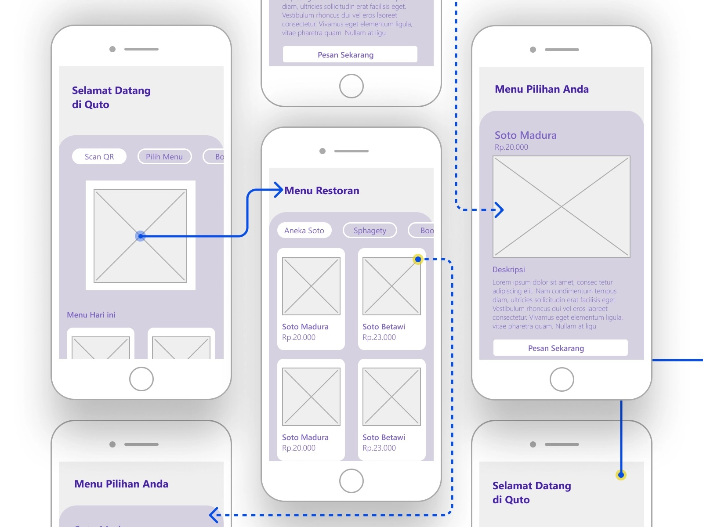
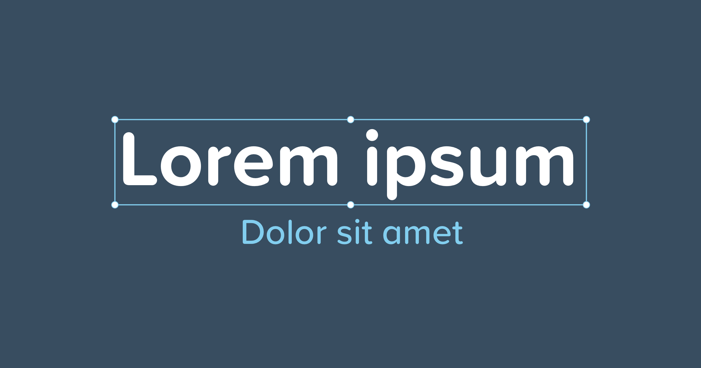
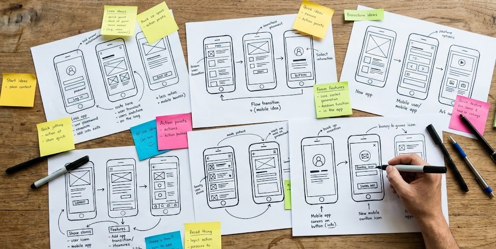
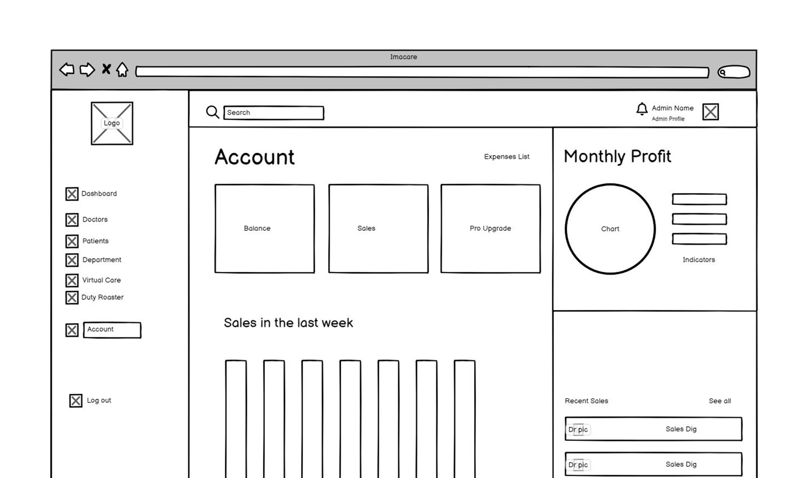
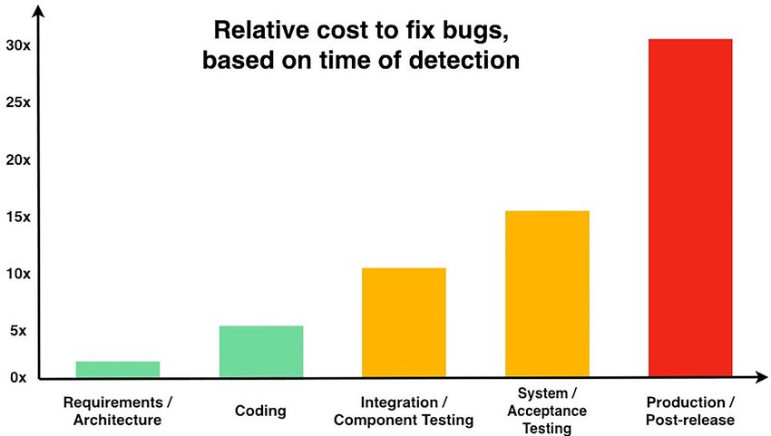
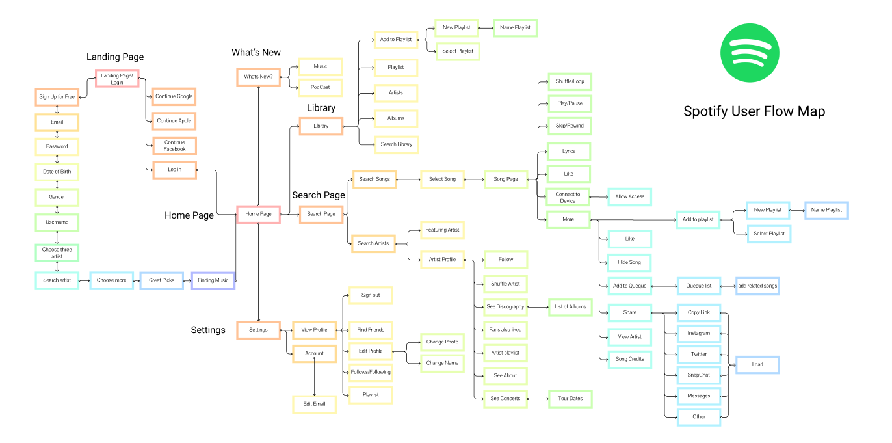

# Самостійна робота студента.
## Виконав: студент групи РПЗ-33, Руденко Дмитро

 

## 1. Контрольні запитання:

- #### Чим відрізняється User Flow від Task Flow?

  **User Flow** — це загальний шлях користувача до досягнення цілі. **Task Flow** — це послідовність дій у межах якогось завдання. Ця схема дуже схожа на юзер флоу, але концентрується на менших задачах.
  Головна відмінність у тому, що якби ми описували все в межах юзер флоу, схема набула б «монструозних розмірів», тому для кращого розуміння її розділяють на маленькі шматочки інформації (таск флоу).

- #### У яких випадках доцільно використовувати Low-Fi?

Low-fidelity (Low-fi) прототипи використовуються для швидкої перевірки концепції. Вони підходять для швидких експериментів та початкового обговорення ідей у команді.

- #### Чому використання тексту "Lorem Ipsum" може зашкодити при створенні вайрфреймів?

  Використання «Lorem Ipsum» створює хибне враження про заповненість екрана. При переході до High-fidelity макетів з реальним текстом може виявитися, що справжній контент не вміщується у відведені блоки або порушує інформаційну ієрархію,
  яку намагалися вибудувати на етапі вайрфреймів.4) Що таке Wireflow?Wireflow — це послідовність нарисів екранів (вайрфреймів), що покривають якусь задачу користувача. Тобто це сценарій із використанням вайрфреймів. Це більш деталізована версія юзерфлоу або таск флоу,
  де замість прямокутників дій застосовуються вайрфрейми екранів.

- #### Чому паперовий та інтерактивний прототип економить бюджет?

Паперовий прототип дозволяє швидко фіксувати ідеї, перекреслювати й виправляти помилки без додаткових витрат часу та ресурсів на ранніх етапах. Інтерактивний прототип дозволяє перевірити логіку, сценарії та зручність до початку програмування.
  Він допомагає виявити проблемні та незручні екрани, що запобігає дорогому переписуванню коду на етапі розробки.
  
## 2. Питання на дослідження

- #### У яких випадках паперові прототипи ефективніші за цифрові?

Паперові прототипи є ефективнішими на найбільш ранніх етапах розробки, коли потрібно швидко зафіксувати ідеї. Вони незамінні під час «мозкових штурмів», оскільки дозволяють легко залучати до процесу всіх учасників
  (бізнес-аналітиків, замовників), які не володіють професійним дизайнерським софтом. Також вони кращі для миттєвої перевірки кардинально різних концепцій без витрат часу на вирівнювання пікселів у графічних редакторах.

- #### Дослідіть сервіс Balsamiq Wireframes: чим він відрізняється від Figma і чому його досі використовують аналітики?

  **Balsamiq** — це спеціальна програма для створення ваєрфреймів, що навмисно імітує неакуратно намальовані від руки фігури. Figma, на відміну від Balsamiq, є інструментом повного циклу (від начерків до High-fi макетів ), тоді як Balsamiq фокусується виключно на Low-fidelity. Його використовують аналітики, бо стиль «від руки» змушує команду та замовників зосереджуватися на структурі та функціоналі, не відволікаючись на обговорення кольорів чи шрифтів. Це ідеальний інструмент для швидкого створення документації та логічних схем.

- #### Що таке "Двері Нормана" (Norman Doors) у контексті UX-флоу?

  **«Двері Нормана»** — це термін Дональда Нормана, що позначає об'єкти, дизайн яких не дає жодних підказок щодо способу їх використання або дає хибні підказки (наприклад, ручка на дверях, які треба штовхати).
  В UX-флоу це ситуація, коли елемент інтерфейсу має поганий афорданс (кнопка не виглядає клікабельною, або жест (свайп) не є очевидним для виконання дії). Це створює розрив у User Flow, змушуючи користувача зупинятися і думати.

- #### Як прототипування впливає на зменшення ризиків у SDLC?

  Прототипування є етапом перетворення ідей на візуальні рішення , що дозволяє перевірити логіку до початку програмування. У межах життєвого циклу розробки (SDLC) це мінімізує ризик створення продукту, який не відповідає потребам ринку або є технічно незручним.
  Виявлення проблем на етапі прототипу економить бюджет, оскільки зміна макета в Figma коштує значно дешевше, ніж зміна архітектури вже написаного та протестованого коду.

- #### Знайдіть у мережі приклад "Monster User Flow" великого сервісу (наприклад, Uber чи Spotify). Проаналізуйте, як дизайнери групують блоки, щоб схема залишалася читабельною.
  
**Spotify** — це величезна екосистема, яка без чіткої структури перетворилася б на нечитабельний «монструозний флоу» через сотні сценаріїв. Дана діаграма ілюструє, як дизайнери керують цією складністю, розбиваючи гігантський потік на окремі функціональні модулі або таск флоу (Home, Search, Playback). Використання глибокого колірного кодування (синій для пошуку, зелений для плеєра) дозволяє миттєво зчитувати логіку та уникати плутанини. Також кожен вузол схеми є схематичним нарисом екрана (вайрфреймом), що показує його анатомію та рух інтерфейсу в складних зонах. Зрештою, логічні конектори та точки прийняття рішень (ромби) розгалужують потік, не перевантажуючи його зайвими лініями. 

[Посилання на дошку у Figma](https://www.figma.com/design/wgifVHt97Lxmg6v4uOeORd/User-Flow-Map-for-Spotify--Community-?node-id=0-1&p=f&t=qAu1egHJ9Z9yuGYm-0)
