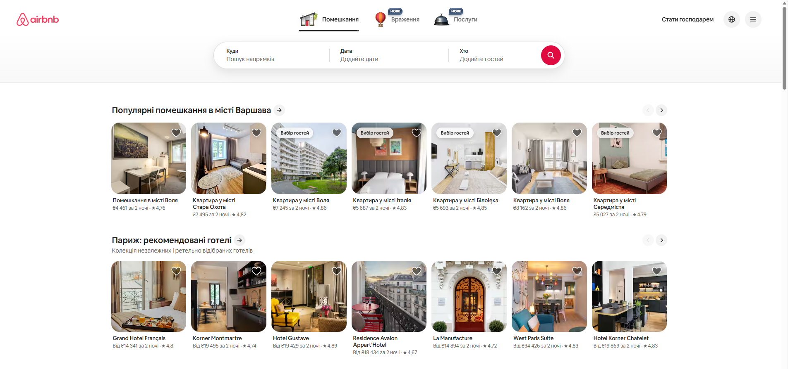
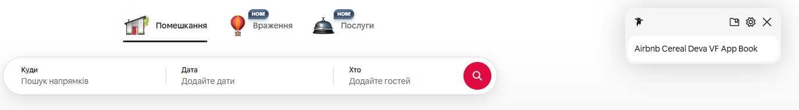
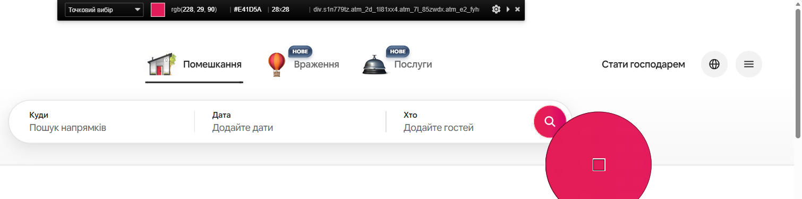

# Самостійна робота студента.
## Виконав: студент групи РПЗ-33, Руденко Дмитро

 

**Аналіз візуального стилю онлайн-сервісу (на прикладі Airbnb)**

#### 1. Вибір сервісу

- **Назва:** Airbnb (сервіс оренди житла).  
- **Посилання:** [тут](https://www.airbnb.com.ua/).
- **Опис інтерфейсу:** Дизайн побудований на принципах «повітряності» та великої кількості вільного простору (white space). Головна мета — не відволікати користувача від перегляду фотографій подорожей.

#### 2. Дослідження типографіки та колористики

**Типографіка:**   

- **Основний шрифт:** Airbnb Cereal. Це спеціально розроблений брендовий шрифт (Geometric Sans), який поєднує в собі грайливість та професіоналізм.  
- **Особливості:** У сервісі чітко пропрацьована ієрархія. Заголовки розділів великі та напівжирні (Bold, ~32 px), тоді як допоміжна інформація про ціну чи локацію подається компактним кеглем (14-16 px). Це забезпечує легкість сканування сторінки оком.

**Колористика:**  

- **Primary Color (Акцентний):** Rausch (насичений рожево-червоний, #E00B41). Згідно з психологією кольору, цей відтінок викликає емоції збудження та любові до пригод. Він використовується виключно для кнопок заклику до дії (наприклад, «Забронювати») та логотипа.  
- **Background (Фон):** Чистий білий (#FFFFFF). Займає близько 60% інтерфейсу, що відповідає правилу гармонійної композиції та забезпечує «чистий» вигляд.  
- **Neutral Colors:** Для заголовків використовується вугільно-сірий колір (#222222), а для тексту світліший сірий колір (#6A6A6A). Це краще за чистий чорний, оскільки знижує навантаження на зір при тривалому читанні.

#### 3. Опис використаних інструментів

Для аналізу я використав інструментарій, вивчений на лекції:

- **Fonts ninja (розширення Chrome):** Дозволив ідентифікувати шрифт Airbnb Cereal Deva VF App.

- **ColorZilla (Eye Dropper):** Я використав «піпетку» для точного визначення HEX-коду основних кольорів.

  
