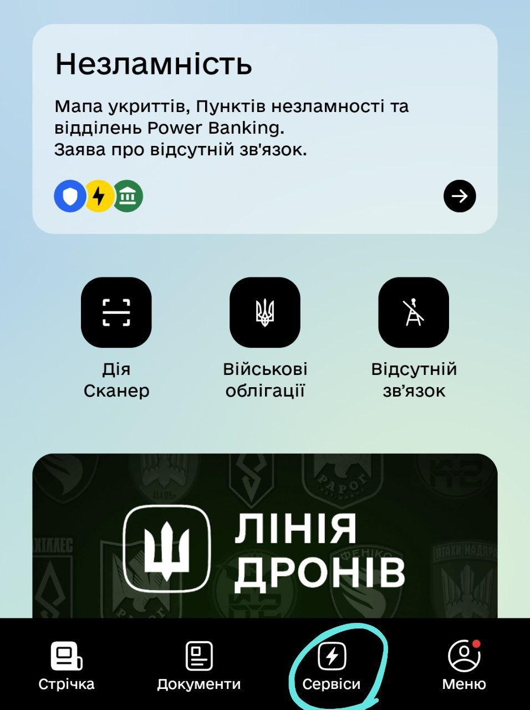

# Самостійна робота студента.
## Виконав: студент групи РПЗ-33, Руденко Дмитро

 

#### 1. Принципи Гештальту в дизайні: Топ-3 за важливістю

Гештальт-психологія пояснює, як людський мозок організовує візуальні елементи в єдині структури.

**Близькість (Proximity).**    
Об'єкти, розташовані близько один до одного, сприймаються як група. Наприклад, у списках тренувань мого фітнес-застосунку назва вправи та її опис розташовані поруч, що дає змогу миттєво зрозуміти їхній зв'язок. 
Це зменшує когнітивне навантаження, допомагаючи користувачеві структурувати інформацію без зайвих розділювачів.

 

 

**Схожість (Similarity).**  
Елементи з однаковим візуальним виглядом (колір, форма) сприймаються як такі, що мають однакову функцію. Наприклад, усі кнопки «Training» у списку тренувань обраного курсу додатку мають однаковий колір та форму. 
Це допомагає користувачеві швидко ідентифікувати інтерактивні елементи, спираючись на попередній досвід.

 

 

**Завершеність (Closure).**  
Мозок схильний «добудовувати» відсутні частини об’єкта, щоб сприйняти його як ціле. Наприклад, іконки в Tab Bar (контурна іконка профілю), де ми бачимо силует людини, хоча лінія може бути перерваною.
Це дозволяє створювати мінімалістичні та естетичні іконки, які не перевантажують інтерфейс зайвими деталями.

 

 

#### 2. Принципи Гештальту на прикладі сервісу Monobank  

**Сервіс:** Monobank  

**Аналіз інтерфейсу:** 

<blockquote>
  
- **Близькість.** На головному екрані сума балансу, номер картки та кнопка «Поповнити» згруповані в один блок. Це дозволяє оку сприйняти «картку» як єдиний об'єкт.

 

 

- **Схожість.** Усі іконки категорій витрат у виписці (їжа, транспорт, розваги) мають однаковий круглий формат і стиль, що поєднує їх у категорію «Історія транзакцій».

 

 

- **Фігура і фон (Figure-Ground).** Використання темної теми або виділення платіжного вікна поверх основного інтерфейсу чітко розділяє фонову інформацію та пріоритетну дію.

</blockquote>
  
#### 3. Основні закони UX-дизайну: Топ-3 для розробника

Ці закони базуються на психології поведінки та визначають ефективність взаємодії з продуктом.

**Закон Якоба (Jakob’s Law).**  
Користувачі проводять більшу частину часу в інших застосунках, тому вони хочуть, щоб ваш продукт працював так само. Наприклад, розміщення «Профілю» у правому нижньому куті або «Пошуку» зверху — це стандарт, якого ми дотримуємося в проєктах.
Це зменшує час на навчання; користувач відчуває себе впевнено в новому інтерфейсі.

**Закон Хіка (Hick’s Law).**  
Час, необхідний для прийняття рішення, зростає із кількістю та складністю варіантів. Наприклад, замість того, щоб показувати 50 вправ на одному екрані, ми розбиваємо їх на категорії (Home, Gym, YouTube). 
Це запобігає «паралічу аналізу», роблячи процес вибору швидким і приємним.

**Закон Фіттса (Fitts’s Law).**  
Час досягнення цілі залежить від відстані до неї та її розміру. Тобто головні кнопки дії (CTA) слід робити великими та розміщувати в зоні досяжності великого пальця. Це зменшує кількість помилкових натискань і підвищує швидкість взаємодії.

#### 4. Закони UX-дизайну на прикладі сервісу Дія

**Сервіс:** Дія (Diia)

**Аналіз інтерфейсу:**

<blockquote>
  
- **Закон Хіка.** На головному екрані відображаються лише найважливіші документи. Всі додаткові послуги приховані в окремому меню «Послуги», щоб не перевантажувати користувача.

 

 

- **Закон Якоба.** Використання звичної навігаційної панелі знизу (Bottom Navigation), як у більшості сучасних iOS/Android застосунків.

- **Естетичний ефект юзабіліті (Aesthetic-Usability Effect).** Завдяки чистому дизайну та приємним кольорам користувачі схильні прощати сервісу дрібні технічні затримки, оскільки інтерфейс виглядає надійним і сучасним.

 

 

<blockquote>
